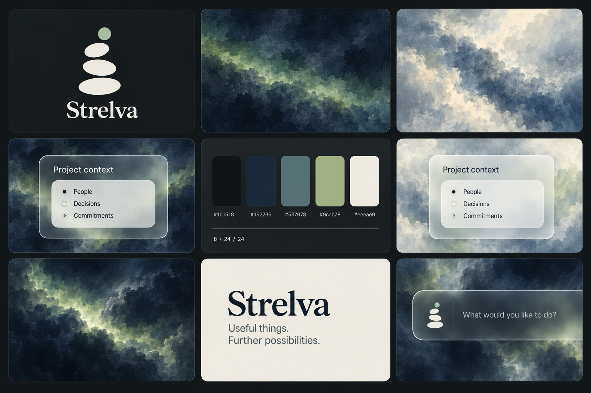
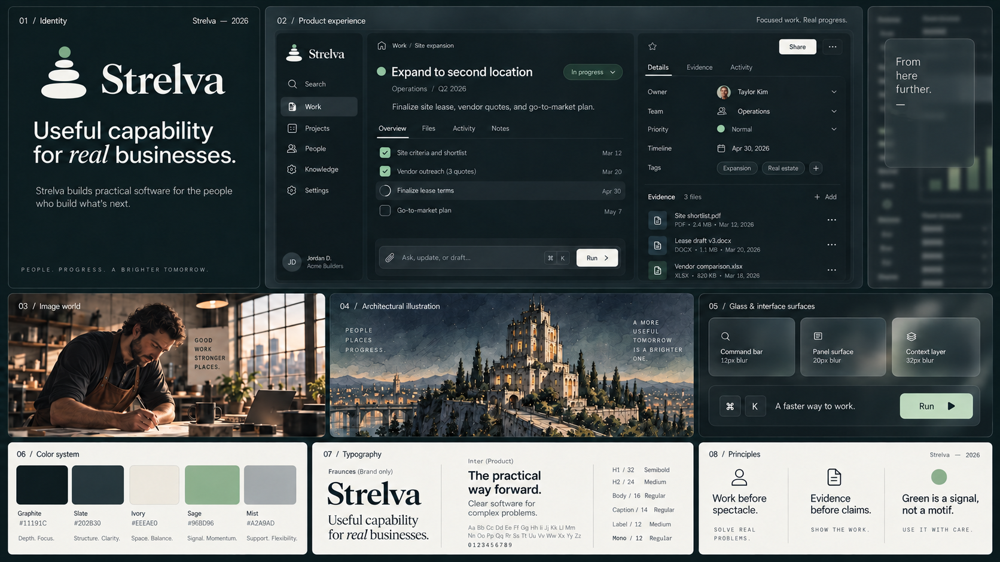
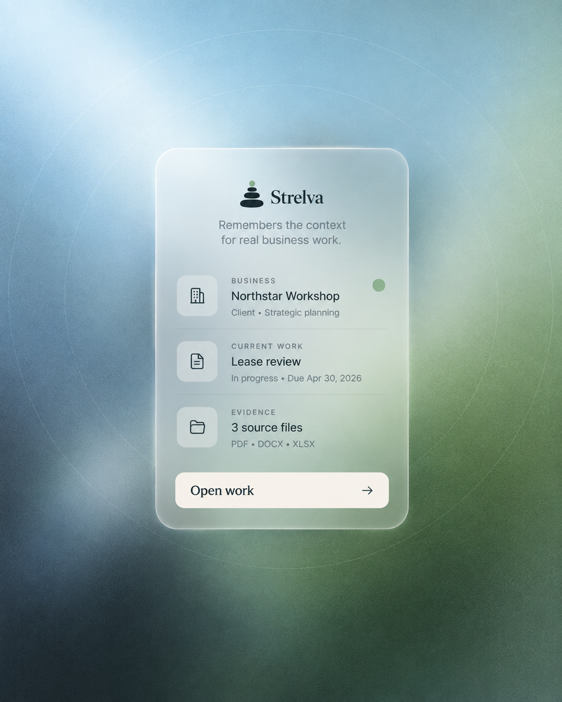
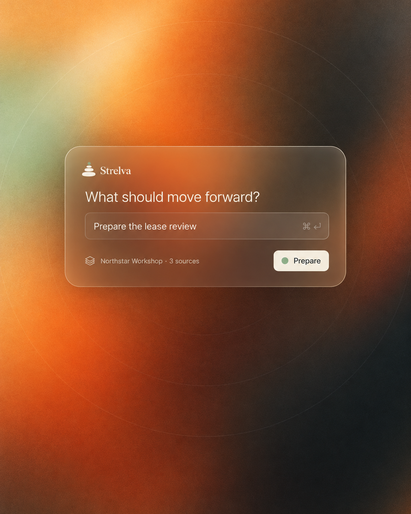
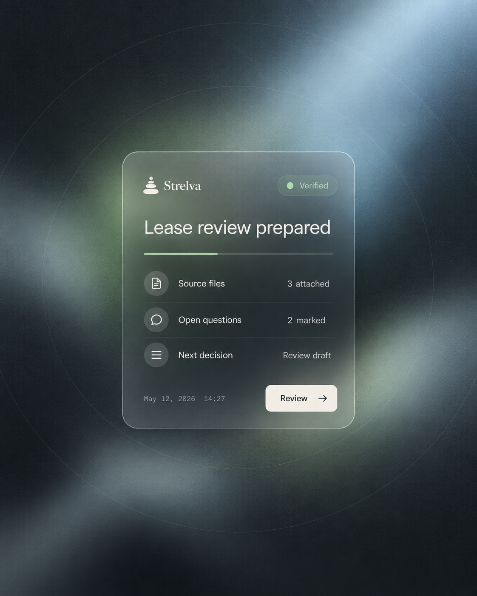
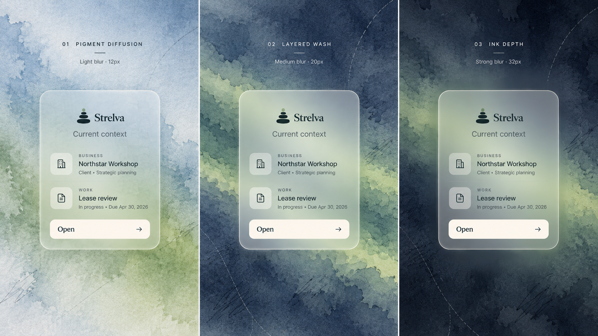
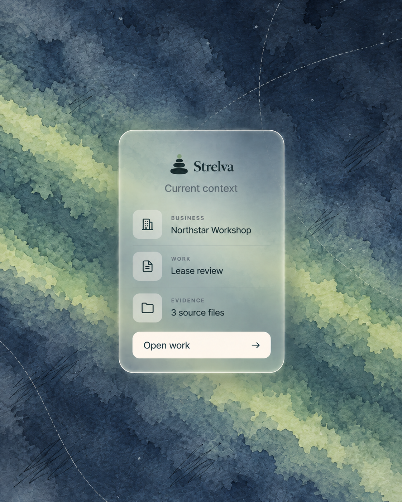

# Strelva brand system

## Latest direction and status

The [atmospheric component contract](./atmospheric-component-contract.md) is the
current source for glass, blur, motion and card construction. Earlier boards
below are historical explorations, not blanket approval. The geometric beam/ring
launch board was rejected; the current exploration uses irregular indigo/sage
cloud material behind real glass and preserves the original cairn. The six
implemented materials remain options for review. Open audit findings are recorded
in the contract and are not fixed by updating this brand document.

Updated visual proposal:



This generated board communicates art direction. Use source components for exact
logo geometry, typography and pixel measurements; do not extract a replacement
logo from the image.

## Earlier exploration

September 17, 2026. Direction selected for refinement by Jacob.

This document turns the selected brand board into working rules for Strelva
identity, product surfaces, imagery, and components. It is a forward design
specification. It does not claim that every current screen or the production
marketing site has already adopted the system.



The atmospheric-software studies below are the primary interface-expression
reference. The board above remains useful for seeing the identity, product,
image world, and token system together.

| Context field | Action field | Evidence field |
| --- | --- | --- |
|  |  |  |

## What Strelva should communicate

**Useful capability for real businesses.**

Strelva should feel ambitious enough to change what a business can do and
practical enough to trust with real work. The identity gives ordinary work
weight. The product shows what happened, what remains uncertain, and what the
person can do next.

The system has three governing rules:

- Work before spectacle.
- Evidence before claims.
- Green is a signal, not a motif.

These rules guide design decisions. They are not required marketing copy.

## Relationship to the references

The primary product expression is **atmospheric software**: one clear software
object held in a luminous spatial field. Broad color, grain, blur, and faint
concentric geometry create depth. The interface remains crisp, bounded, and
usable. This treatment can focus attention on context, intent, evidence, or a
transition without turning the product into a conventional dashboard.

The material-world board supplies people, businesses, tools, paper, stone,
worked metal, warm task light, and shifts in scale. The architectural reference
adds ink linework, watercolor texture, deep navy, warm masonry, and selective
sage washes. The product interface contributes precision, hierarchy, and
operational clarity.

Linear is a craft reference for technical density, shared edges, restrained
motion, and quiet chrome. It is not a source for copied layouts, gray-on-gray
styling, or component silhouettes. Strelva remains warmer and more material,
but the product should read as software first. Editorial treatments frame the
technology; they do not dominate it. Soft surfaces and transitions should make
complex work feel approachable without making the interface vague or toy-like.

Use the atmospheric treatment for focused entrances, empty-to-active states,
command moments, result handoffs, and brand-led product imagery. Repeated work,
dense editing, comparison, and administration still need efficient product
layouts. Do not put every control in a floating glass object.

## Identity

### Mark

The primary mark is the existing four-part cairn in `src/components/Logo.tsx`:
three irregular horizontal stones and one small circular signal above them.
Do not redraw it as symmetrical pills, add outlines, or convert it into a
literal illustration.

- The three stones use the foreground color.
- The top circle may use Sage when color is available.
- Use one color when reproduction or contrast requires it.
- Keep the mark upright. Do not rotate, animate individual stones
  continuously, or use it as a loading spinner.
- Literal stacked stones should remain rare in imagery. The mark already owns
  that idea.

The clear space around the mark is at least the diameter of the top circle.
The minimum digital size is 20 CSS px tall for the mark alone and 24 CSS px tall
inside an interactive control. Inspect the actual rendering rather than relying
on those minimums for every context.

### Wordmark

Set `Strelva` in Fraunces at regular or medium weight. Use the shipped
`LogoFull` component when the mark and name appear together in product code.
Do not typeset the name in all caps or expand its tracking to mimic the small
editorial labels.

### Lockups

- **Primary:** mark left, wordmark right, 8–12px optical gap.
- **Compact:** mark only, with an accessible name supplied by its link or
  control.
- **Editorial:** wordmark alone when the mark already appears nearby.
- **Reversed:** Ivory mark and wordmark on Graphite; the signal may remain Sage.

Do not place the lockup over photography. Put it on a solid Graphite, Slate, or
Ivory field.

## Color

The five brand colors are source colors, not the component API. Components use
semantic tokens so state and contrast remain stable if the palette evolves.

| Source | Hex | Primary role |
| --- | --- | --- |
| Graphite | `#11191C` | Dark canvas, dark text on light fields |
| Slate | `#202B30` | Raised dark surface, secondary dark canvas |
| Ivory | `#EEEAE0` | Primary light text, warm light surface, filled action |
| Sage | `#96BD96` | Selection, focus, active signal, restrained brand accent |
| Mist | `#A2A9AD` | Supporting text and neutral information |

Recommended semantic mapping for the dark product theme:

```css
--brand-canvas: #11191c;
--brand-surface: #202b30;
--brand-text: #eeeae0;
--brand-text-muted: #a2a9ad;
--brand-action: #eeeae0;
--brand-action-text: #11191c;
--brand-accent: #96bd96;
--brand-focus: #96bd96;
--brand-selection: color-mix(in oklch, #96bd96 22%, transparent);
--brand-border: color-mix(in oklch, #a2a9ad 18%, transparent);
--brand-border-strong: color-mix(in oklch, #a2a9ad 32%, transparent);
```

Graphite with Ivory has a measured contrast ratio of `14.82:1`. Graphite with
Sage is `8.49:1`. Slate with Ivory is `12.06:1`; Slate with Sage is `6.91:1`.
These pairs support normal text. Do not assume translucent mixtures, Mist on
Ivory, or Sage on Ivory pass. Test their rendered values.

Sage does not mean success by default. Product states still need separate
semantic colors for success, warning, critical, and informational data. Pair
every state color with text or an icon.

### Atmospheric fields

Atmospheric fields may extend beyond the five source colors. They are
environmental color, not component tokens or status meaning.

- **Context:** mist blue into Sage and Graphite. Calm, persistent, spatial.
- **Action:** amber into burnt orange and Graphite. Focused, immediate, warm.
- **Evidence:** Graphite into cool Mist with restrained Sage. Technical and
  resolved.

Keep the field broad and continuous. Use two dominant color regions and one
minor signal rather than a rainbow gradient. Fine grain prevents the blur from
feeling synthetic. Faint concentric rings may establish focus, but they should
not imply measurement, progress, or a radar system unless the product does.
Text and controls belong inside a readable interface surface, never directly on
the field.

## Typography

Strelva uses the fonts already shipped by the application. Inter carries the
system; Fraunces creates a small number of recognizable brand moments.

- **Fraunces:** wordmark and rare display statements. Default to regular
  weight. Do not use it for routine page titles, card titles, navigation, or
  operational state.
- **Inter:** navigation, product text, forms, records, evidence, controls, and
  data, including most page and section headings. Use 400, 500, and 600 for
  authored components; 700 is reserved for a demonstrated need.

The board's DM Sans treatment is a visual reference, not a font migration.
Inter remains the product face unless a tested system-wide change replaces it.

Use the global roles: metadata `12/16`, compact `14/20`, body `16/24`,
introduction `20/28`, component heading `24/32`, section `32/40`, page `40/48`,
and display `64/72`. A component uses at most three sizes and three weights.
Use tabular numerals for aligned comparisons. Avoid widely tracked uppercase
text for instructions or body copy; reserve it for short metadata labels.

Use no more than one Fraunces text role in a viewport section. When the wordmark
is prominent, keep nearby headings in Inter. Fraunces should not appear inside
glass utility surfaces. Check line endings, optical size, and wrapping at every
responsive transition; do not shrink display type to protect a layout.

## Composition

- Build on the 8px grid with 4px optical corrections.
- Prefer shared edges, type, proximity, and whitespace before adding a card.
- Keep the work or result visually primary. Navigation and product chrome stay
  quieter.
- Use imagery in bounded content regions. Never place fields, controls, or
  important copy over an image.
- Use asymmetry when it strengthens hierarchy. Do not turn every page into a
  uniform three-column brand-board grid.
- Use full-bleed media only where the media is the object being inspected. It
  must not become a decorative page background.

## Component construction

Start with the project's shadcn/ui configuration, tokens, and owned component
contracts. Compose existing primitives before adding a dependency. A new
primitive must solve repeated behavior, not merely reproduce a visual sample.

Build each component in this order:

1. Grid and relationship to surrounding content.
2. Outer geometry and responsive footprint.
3. Safe space and content groups.
4. Text, media, controls, and data.
5. Typography and optical alignment.
6. Hover, pressed, focus, selected, pending, success, empty, disabled, and
   error states that apply to the behavior.

### Geometry

- Substantial surface: 24px padding by default and 24px radius.
- Compact named surface: 16px padding.
- Feature surface: 32px or 48px padding when the content needs it.
- Control radius: 12px. Utility surface radius: 8px. Pills are limited to
  status, tabs, filters, and similarly compact controls.
- Ordinary control: 48px minimum content height, with 12px vertical and 16px
  horizontal padding.
- Dense control: 40px minimum content height, with 8px vertical and 16px
  horizontal padding.
- Compact control: 32px minimum content height, with 4px vertical and 12px
  horizontal padding.
- Row minimums: 40px dense, 48px standard, 64px two-line.
- Icons: 16px small, 20px default, 24px prominent. Use one icon family and
  consistent stroke weight.

The 24px default applies to panels, work objects, inspectors, dialogs, and
authored glass surfaces. Use 16px only when the component is explicitly compact
or when repeated data density requires it. Do not vary panel padding for visual
rhythm alone. Nested content uses internal gaps rather than another 24px inset.

Softness comes from the 24px outer radius, generous safe space, low-contrast
boundaries, and continuous movement between states. Controls remain firmer at
12px so the action layer is distinct from the surrounding surfaces. Do not turn
rows, tables, or every nested group into rounded capsules.

The earlier 6–8px-radius product rule remains historical evidence in
`docs/design-kit.md`; it should not silently constrain this forward direction.
Migration needs rendered comparison and component-level review.

### Surfaces, glass, and borders

Resting surfaces are flat. Use one-pixel structural borders and shared edges.
Elevation must explain layering, such as a popover above work or a dialog above
the page.

Glass is part of the product language when it reveals context beneath a working
layer. Use it for floating command bars, contextual inspectors, popovers,
temporary navigation, and selected controls over a stable application canvas.
Do not wrap every card in glass or place translucent UI over photography.

```css
--brand-glass: color-mix(in oklch, #202b30 78%, transparent);
--brand-glass-strong: color-mix(in oklch, #202b30 90%, transparent);
--brand-glass-border: color-mix(in oklch, #a2a9ad 22%, transparent);
--brand-glass-highlight: color-mix(in oklch, #eeeae0 8%, transparent);
--brand-blur-compact: 12px;
--brand-blur-surface: 20px;
--brand-blur-layer: 32px;
```

- Use `12px` blur for compact controls and popovers, `20px` for panels and
  inspectors, and `32px` only for large temporary layers such as command
  palettes or modal backplates.
- Pair blur with `saturate(110%–115%)`; stronger saturation makes the surface
  feel glossy and competes with the content.
- Use a readable opaque Slate fallback when backdrop filtering is unavailable.
- Keep 24px padding on substantial glass surfaces and 16px on compact popovers.
- Use one light-facing border and, when separation requires it, the standard
  popover or dialog shadow. Avoid inner glow and frosted-white haze.
- Verify text contrast against the worst content that can appear beneath the
  surface. Blur does not guarantee legibility.
- Keep text, icons, borders, and status indicators sharp. Blur belongs to the
  backdrop, not to the content layer.
- Avoid stacking blurred ancestors. Use one composited blur layer for a region
  and profile it on representative mobile hardware.

### Blur material



The watercolor reference defines what sits beneath the optical blur. Preserve
the evidence of physical pigment: cold-press paper tooth, translucent wash
layers, low-frequency tide marks, pooled indigo edges, and a restrained Sage
seam. Blur should soften this material without erasing it into a generic radial
gradient.

Use three treatment levels:

- **Pigment diffusion:** pale Mist and Sage, broad wet-on-wet transitions,
  visible paper grain, and `12px` interface blur. Best for light entrances and
  gentle orientation.
- **Layered wash:** overlapping indigo, Slate, and Sage washes with irregular
  boundaries, a brighter pigment seam, and `20px` interface blur. This is the
  default atmospheric treatment.
- **Ink depth:** pooled Graphite and navy around the perimeter, muted Sage light
  through the center, sparse construction marks, and `32px` spatial blur. Use
  for focused handoffs and temporary large layers.



Build the field as a separate decorative layer. Keep interface glass, text,
focus rings, and controls above it. A production approximation may combine a
licensed or generated watercolor texture with two broad color washes, fine
grain, and sparse vector arcs. Do not blur a screenshot of the interface to
manufacture the effect.

Soft UI here means quiet depth, not neumorphism. Use tonal separation, a faint
edge highlight, and restrained blur. Avoid paired light-and-dark embossing,
floating marshmallow controls, large diffuse shadows, and controls that become
indistinguishable from their surface.

Suggested shadows remain those in the global standard:

- Popover: `0 4px 16px -4px rgb(0 0 0 / 12%)`
- Dialog: `0 16px 48px -16px rgb(0 0 0 / 20%)`

### Controls

- The primary action is usually warm Ivory on Graphite or Slate.
- Sage marks focus, selection, connection, or a meaningful signal. Do not use
  it on every primary button.
- Keep labels literal: `Review change`, `Save work`, `Connect`, or `Publish`
  rather than abstract encouragement.
- Icon-only controls require an accessible name and at least a 24×24px target;
  use 44×44px where touch is expected.
- Keep essential actions visible without hover or animation.

### Work and evidence

A Strelva work component exposes enough state to judge the result:

- The business or other subject.
- What the work is.
- Its current state.
- Evidence or provenance when relevant.
- The next available action.
- Permission, approval, or uncertainty when it changes what can happen.

Do not decorate a generic card with the cairn and call it a Strelva component.
The identity comes from clear state, evidence, language, material color, and
consistent behavior.

### Technical character

The product should make its technical capability visible through useful state,
not decorative circuitry. Favor command bars, timelines, diffs, source lists,
execution receipts, compact status rows, keyboard affordances, and live system
context when the task supports them. Use monospace only for identifiers, code,
timestamps, commands, and machine-readable values. Keep the primary action and
plain-language result legible to someone who does not operate software for a
living.

## Imagery

### Photography

Give real work serious attention: concentrated people, useful tools, receipts,
drawings, food, machinery, paper, stone, metal, glass, and the places where work
happens. Use directional daylight or warm task light with retained shadow
detail. Grain and haze are optional, not default filters.

Across a collection, green phenomena may appear in roughly 10–20% of images.
Most images should work without them. Avoid generic laptop scenes, synthetic
teams staring at screens, floating UI, robot imagery, and unexplained cosmic
spectacle.

### Illustration

Use fine ink linework, visible construction marks, watercolor variation, deep
navy, restrained sage, and warm masonry or paper tones. Illustrations should
depict a specific business, place, process, or system. Do not copy the supplied
tower or turn every subject into a monumental building.

### Material still life

Paper, rough stone, graphite, worked metal, wood, and warm window light form the
material vocabulary. Every object should have a reason to be present. Avoid
staging repeated cairns or scattering sage props through every composition.

## Motion

Use motion to preserve object identity and explain state change:

- 120ms for immediate feedback.
- 200ms for disclosure.
- 320ms for larger transitions.
- 4–8px travel for small entrances.
- `cubic-bezier(0.2, 0.8, 0.2, 1)` as the starting curve.

Motion must be interruptible and honor `prefers-reduced-motion`. Do not animate
the logo continuously or turn operational state into ambient movement.

## Voice

Use direct language that names the result, subject, evidence, and next action.
Make the ambition visible through the capability, not through inflated claims.

Prefer:

- `Useful capability for real businesses.`
- `Review the proposed change.`
- `Published, but not yet verified.`
- `Three sources support this result.`

Avoid:

- Generic transformation promises.
- Claims of intelligence without a visible mechanism.
- Invented customer outcomes or metrics.
- Mystical explanations for the green signal or cairn.

## Review checklist

Before a brand-system component is accepted:

- It uses semantic tokens rather than source hex values inside the component.
- It reuses an owned primitive or explains why a new one is necessary.
- Its geometry follows the 8px grid, uses 24px default surface padding, and
  follows the named control sizes.
- Glass reveals useful application context, has an opaque fallback, and passes
  contrast over the worst permitted background.
- Fraunces is limited to a deliberate brand moment; operational typography uses
  Inter.
- Relevant interaction, loading, empty, permission, and failure states exist.
- Keyboard order, accessible names, visible focus, and contrast are verified.
- It reflows at 320 CSS px and is rendered at 360, 768, 1280, and 1600px.
- Enlarged text and realistic long content do not break the task.
- Imagery remains separate from controls and important copy.
- The main work remains clearer than the brand treatment around it.
- Any migration from current product tokens is stated as a migration, not
  implied by the concept board.
