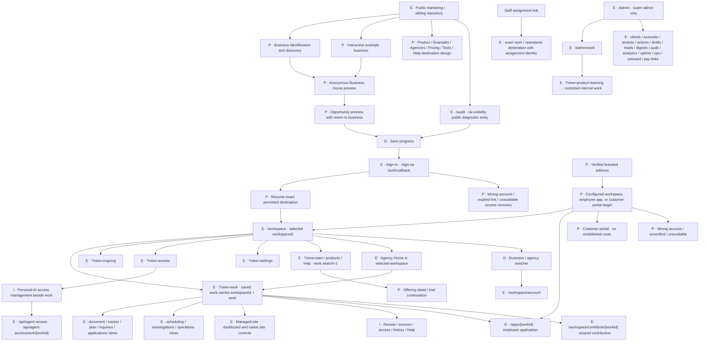

# Entrances and navigation design

September 16, 2026. Proposed behavior for review, not accepted implementation or production evidence. Scope: the entrances and navigation checklist in [todo.md](../../todo.md). Jacob requested strong radii. Use 28–36px outer panels, 20–24px cards, and pill-shaped primary controls as the visual proposal; this does not change existing design tokens.

## Evidence

Inspected the sidebar, workspace URL parser, application entry, contribution entry, agency Home, and restricted staff console source. Existing means present in local source, not verified live. Latest accepted business-entry behavior remains in [DESIGN.md](../../DESIGN.md#public-discovery-into-business-home). PRODUCT_STRATEGY.md remains unavailable in the searched workspace.

Mobbin screenshots inspected:

- [Notion account entry](https://mobbin.com/screens/b8c55702-23b9-4c60-b8d4-5212cb000bbe): account addition appears separately from the workspace list.
- [Notion account/workspace settings](https://mobbin.com/screens/293d3145-22c7-4d16-9394-709dba74b6f7): personal and workspace sections are visibly grouped.
- [Linear navigation](https://mobbin.com/screens/51c2bd60-f22d-4879-8c28-c5800ac1f4b6): a persistent rail groups workspace and team destinations beside the main work.
- [Slack mobile workspace drawer](https://mobbin.com/screens/e4fa504c-e639-497e-a270-f34b305dc437): a large dark drawer uses readable workspace rows and an obvious selected item.

These are layout precedents. Their complete behavior and suitability for Strelva have not been tested.

## Screen map

E = existing local route or route family. P = proposed screen/state. I = inline panel. D = dialog/drawer. An existing route can host proposed behavior. Names in quotation marks are descriptions, not new URL commitments.

The graph covers the requested entrance/navigation scope; it is not an inventory of every editor, API or administrative detail screen. Website controls retain their existing [client dashboard map](../client-dashboard-ia.md). Public diagnostic routes `/audit` and `/ai-visibility` remain direct product entrances and need the same save/return behavior. No branded workspace address or native AI-host connector is established by this proposal.

## First destination

An explicit authorized destination wins over a role default. Opening a link never grants access. If an explicit destination is unavailable, explain that state before offering another destination.

| Person | Proposed default when no specific link was supplied | Explicit link behavior |
| --- | --- | --- |
| Visitor | Public business entry, with example alternate | Open the public result/example; preserve it through save and signup |
| Returning owner | Last accessible business Home; chooser when none can be safely restored | Open the exact work and business, including after authentication |
| Employee | Assigned app picker if there are several; direct app if only one | `/apps/[workId]`, with no owner setup shell |
| Agency member | Selected agency Home showing its private work and explicitly shared client work | Open client-owned work with client name and agency access visible |
| Collaborator | Shared-work chooser, proposed within Account | Exact contribution link, with only granted controls |
| Strelva delivery staff | Assigned-work list, proposed without admin privileges | Exact accepted assignment; show scope, expiry and permitted actions |
| Super admin | Restricted console when deliberately entered | Existing restricted administrative destination |
| Personal AI | API response, no mandatory visual landing | Authorized work resource; denied/expired scope returns an API error |

## Five navigation alternatives

These are materially different proposals, not five required implementations. All preserve business identity, direct app entry, and permission checks.

| Option | Screen behavior | Benefit | Cost |
| --- | --- | --- | --- |
| A · Rounded persistent rail | Business picker at top; accepted navigation always labeled; account at bottom | Easiest to inspect context and find destinations | Takes desktop width |
| B · Compact rail with expanding labels | Collapsed icons by choice; expand control; business and actor stay in work header | Gives previews and applications more space | Icons need tooltips, keyboard names and an obvious way to expand |
| C · Top navigation | Business picker and Home/Work/Ongoing across header; access/settings in More | More horizontal space for the result | Long business names and many sections crowd the header |
| D · Business Home as launcher | Business illustration and work cards form the landing; menu opens destinations | Strong visual connection to the selected Home | Repeated work may take extra navigation; scene cannot be the only way to find work |
| E · Agency work queue | Agency/client list beside shared work; client-owned result opens in place | Faster repeated client review | Too much context for an ordinary owner; agency-specific composition only |

Boards illustrate A, its optional collapsed B state, and agency/direct-use contexts. C–E remain alternatives for judgment. A is the working proposal, not a recorded selection.

## Switcher and visible authority

The current business button opens a searchable dialog on desktop and a large drawer on mobile. Group rows as Your businesses, Agencies, and Client access through the selected agency. A person may belong to multiple agencies. Each business row shows its role and access path; duplicate client names include a distinguishing location or domain. If the same business has multiple grants, show the available access paths rather than silently choosing the broadest authority.

Personal identity remains at the bottom of the rail and in the switcher footer. Switching business does not switch signed-in identity. Account switching uses a separate authentication action and retains the intended destination. Do not copy Notion's simultaneous-account capability without explicitly implementing it.

Example header: “Maple & Bean” followed by “Alex Morgan via Northline · Can review.” An expandable “Your access” panel explains permitted actions and expiry. Put the reason beside a disabled consequential action: “Publishing requires the owner.” A reviewer may comment; a review grant never becomes publish permission. Agency membership does not imply access to every client.

On business switch, preserve a recoverable draft or ask before discarding an unsaved local edit. Clear the previous business's records, reauthorize the target, and reject stale responses. Never display old records under the new business name.

## Page, panel, dialog or no interface

| Interaction | Proposed surface |
| --- | --- |
| Business Home, work result, direct app, contribution, account, ongoing list | Navigable page/state with stable URL |
| Business switcher, invitation acceptance, connection permission review, destructive confirmation | Dialog or mobile drawer; auth itself can use the existing page |
| Work review, comments, sources, activity, access explanation, contextual help | Inline panel beside the result; mobile full-height sheet |
| Correct one inferred business fact, dismiss an opportunity, undo dismissal | Inline edit/action with recovery |
| Small one-off comparison, inspect prepared changes, answer a necessary question | Temporary generated panel attached to durable work; retained decisions survive dismissal |
| Background refresh, API request by authorized AI, routine state reconciliation | No new page; update the relevant status or return the API result |

Generated controls may propose or collect input; they do not bypass the same permission and approval boundaries as ordinary controls.

## Navigation and recovery contract

- Push history for opening another work item, changing business or visiting another primary view. Back restores the prior context, filters and scroll position when still authorized. Use replacement for canonicalizing a URL, not every user navigation.
- Store business/work/assignment identity in supported canonical locations. Keep transient hover, open switcher and cosmetic state out of durable links. A share action copies the canonical work URL, never a permission token.
- Refresh reconstructs the selected view from its URL and server data. Saved local form edits are actor- and business-scoped and must never appear after account switching.
- Sign-in retains a validated intended destination and a server-owned continuation for anonymous results. Cancel returns to the existing result. Wrong account offers Switch account; unavailable access does not silently send the person to another business.
- Opening work in another tab creates independent navigation context. Switching business in one tab must not silently switch another tab's active work. Revalidate permissions after membership changes.
- Mobile menu Back closes the open drawer before leaving the page when the drawer participates in history. Escape, outside dismissal and Close restore focus to the trigger. Main navigation uses real links where possible.
- Direct apps opened from workspace offer “Back to Elm Street Studio” only when that workspace is accessible. Employees without workspace permission get “My apps” or their verified assigned-app chooser. A copied app link never requires an owner workspace visit.
- Expired authentication preserves eligible drafts, then returns to the same work after sign-in. Revoked access shows an unavailable state and does not reveal private titles or records. Network failure offers retry without claiming access was revoked.

## Mobile and collapsed desktop

Use a compact mobile header with Menu, business name and account avatar. Open a rounded, almost full-height navigation drawer with the same ordered labels as desktop. The business switcher is a separate drawer step with a Back control; avoid stacking multiple small popovers. Close the menu after navigation. Work cards stack beneath the business illustration. Keep action areas clear of the keyboard and safe-area inset.

Desktop collapse is a reversible personal preference. Business, actor and effective permission stay visible in the main header, even while the rail is icon-only. Do not collapse automatically in the middle of a task. Reduced motion removes large transitions; navigation does not depend on animation.

## Branded addresses

Three genuine choices remain: a business owner workspace, one employee application, or a customer portal. Recommended mechanism: the authorized business administrator configures one explicit destination for each verified hostname, with separate hostnames when audiences differ. This recommendation requires routing, domain verification and destination authorization work; it is not an existing feature. Do not infer destination from whoever signs in.

| State | Proposed screen and recovery |
| --- | --- |
| Verified workspace destination | Branded sign-in if required, then the selected business Home for authorized members |
| Verified employee-app destination | Exact app, with its permitted-use authentication; owner may have a quiet manage link |
| Verified portal destination | Exact customer portal and customer identity boundary; proposed capability only |
| Wrong account | “This account cannot open this workspace.” Show current identity, Switch account and a legitimate request-access option when supported; reveal no private business data |
| Domain unverified | Do not serve customer work or trust unverified branding. Owner sees verification state on the canonical Strelva settings page; visitor sees generic address-not-ready guidance only where the host can be safely served |
| Target missing, retired or disabled | “This address is unavailable.” No fallback into another business; provide safe account/support navigation |
| DNS or TLS unavailable | Browser/network failure may precede any app screen. Canonical Strelva domain settings must explain recovery; do not promise an app-rendered error for every infrastructure failure |

## What would prove this design

Image boards are visual proposals. They do not prove interaction, persistence or authorization. Before checklist completion, exercise desktop and mobile with an owner, employee, multi-agency member, collaborator and delivery staff member. Cover wrong account, revoked access, switching while a request is in flight, dirty forms, failed discovery, sign-in cancellation, refresh, Back, copied links, independent tabs and inaccessible branded destinations. Check keyboard and screen-reader behavior. Record Jacob's decisions separately from implementation evidence.
