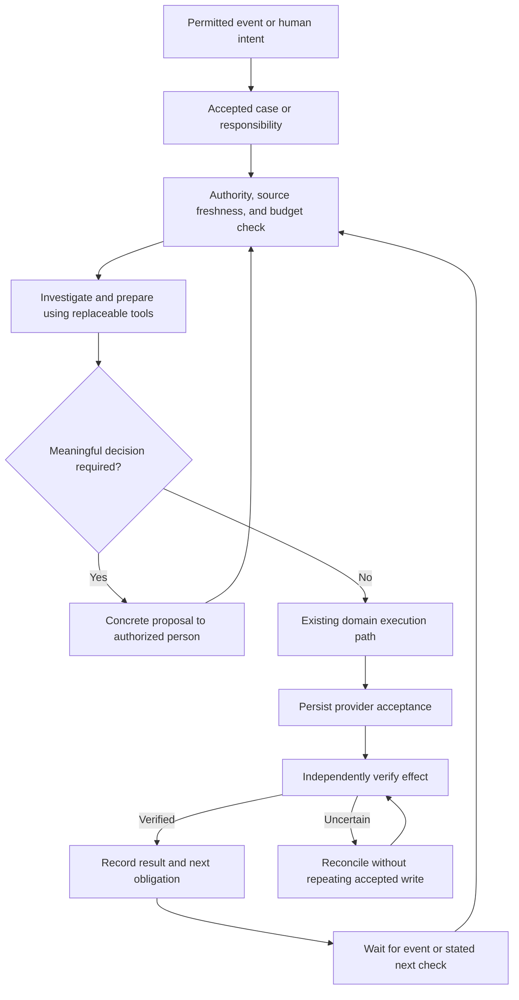

# Strelva rebuilt from the current frontier

Strelva should become easier to use as its capabilities grow. A business should be able to entrust it with a concrete result, continue using its existing systems, and hear from Strelva when a decision matters or the result is ready. Building another place to configure agents, maintain trackers, and review generated plans would leave much of the new capability unused.

The strongest architectural opportunity is to separate **what the business wants kept true** from **the method used to achieve it**. Methods can change as models improve. Business authority, source records, accepted limits, completion evidence, and recovery responsibility must survive those changes. The current repository has useful parts of this foundation, especially governed website changes and inquiry delivery. It does not yet implement a general business operator.

This report examines capability changes from **March 12 through September 12, 2026**, against the repository at commit `a376d20` and its September 11 product records. It treats current implementation, vendor availability, demonstrated performance, and customer reliability as different evidence. No production operation, new customer permission, paid trial, or strategic adoption is established here. The horizon for the obsolescence test is March 12, 2027.

The recommendation is to develop three serious alternatives together: Strelva maintaining bounded conditions across existing tools; Strelva creating and maintaining the small applications those conditions require; and Strelva providing trusted execution that other agents can invoke. These share an execution foundation but have different buyers, interfaces, distribution, and support costs. A fourth possibility, maintaining a business's ability to transact through other people's agents, deserves its own investigation. None requires making the existing navigation the product's permanent structure.

## Evidence and current product reality

**Observed in source:** the product includes Managed Websites, its owner and operator surfaces, public diagnostics, workspace persistence, inquiries and delivery, documents, trackers, plans, reusable inquiry patterns, scoped handoffs, and internal experiment records. General app generation, broad autonomous execution, third-party agent participation, and enterprise acceptance remain material gaps. The [horizontal acceptance ledger](../strelvav2-horizontal-acceptance.md) explicitly distinguishes these from implemented slices.

**Selected intent:** the [horizontal brief](../horizontal-product-brief-2026-09-11.md) supersedes inquiry-first and agency-first definitions of the overall product. People across organization sizes should discover improvements, create products, and obtain ongoing work. Self-service, Strelva help, and outside agencies are fluid participation modes. Subscription plus included work and additional usage is the selected pricing direction; numerical prices and metering are open.

**Important correction:** older operator documentation describes owner inactivity as churn risk. [Current churn code](../../src/lib/churn.ts) explicitly rejects that assumption and flags payment problems instead. This report does not propose fixing an already-fixed behavior. It does recommend extending the same reasoning to activation, retention, and outcome measurement elsewhere.

**Not established:** this investigation did not operate customer accounts, test frontier providers on Strelva workloads, interview current customers, measure willingness to pay, or verify today's deployments. Local release status comes from [CONTEXT.md](../../CONTEXT.md) and the acceptance records. A paying website relationship does not grant access to a customer's inbox, calendar, accounting system, or customer communications.

Source IDs `F` identify dated frontier evidence, `X` adjacent-market or contradictory evidence, and `R` repository evidence. Product proposals and their numerical test thresholds are analytical recommendations, not observed customer results. The source register at the end records dates and limitations.

## 1. Capability delta

This section includes only changes with consequences for architecture or user behavior. Scheduling, retrieval, JSON output, browser automation, checkpoints, coding agents, and multiple agents all existed before the window. Their existence is not a six-month discovery. The relevant changes are stronger complete-work performance, broader practical access, more economical execution, and native systems exposing meaningful actions.

| ID | Material change within the window | Previous constraint and what can now be delegated | What became practical | Product assumption invalidated |
| --- | --- | --- | --- | --- |
| C1 | Managed long-running execution: Anthropic's April 8 public beta and OpenAI's September 10 public beta provide more of the session, recovery, and orchestration machinery [F1], [F2], [F3] | Teams previously assembled and maintained much of the stateful runtime themselves. A bounded investigation can now persist through disconnection, wait for an event or approval, and resume without a user reconstructing the conversation. | Buying the runtime rather than implementing every lifecycle mechanism. Anthropic's launch price was $0.08 per active session-hour plus tokens, not the full cost of a finished job. | Every job needs an active chat session, or Strelva must own a sophisticated proprietary agent loop. |
| C2 | Browser operation gains more usable targeting and fewer interaction round trips: August 20 GA computer use and a browser tool combining page structure with screenshots [F4] | A supported portal without an adequate API previously meant human traversal or bespoke brittle scripts. A qualified agent can retrieve, reconcile, and complete a tested route, stopping at sign-in or unexpected state. | A vendor-published customer example reports a longest workflow falling from 32 to 13 minutes and about 30% lower task cost. No sample size supports treating its completion claim as general reliability. | An integration must stop at an instruction to the owner whenever no connector exists. |
| C3 | Stronger long-task execution expands the size of bounded work, but not to unrestricted business operation [F5], [F6] | Owners or operators often had to break investigations into many small tasks and repeatedly restore context. More of the investigation, preparation, and checking can now be delegated as one objective. | Fable 5.1's September provider evaluation reports 41.7% strict OSWorld 2.0 completion versus 36.1% for Fable 5. AutomationBench rises from 17.1% to 31.4%. These still leave substantial failure. | The product must expose every intermediate task to make progress; alternatively, that a stronger model makes arbitrary end-to-end autonomy safe. Both assumptions fail. |
| C4 | Managed persistent memory adds scoped stores, attribution, redaction, and rollback in the April 23 public beta [F7], [F8] | Retrieval and saved files already existed. Teams still built much of the administration around mutable agent knowledge. An agent can reuse confirmed context, prior resolutions, and system quirks between cases with less bespoke infrastructure. | More accessible maintenance of accumulated working knowledge. Reliability depends on source versions and contradiction handling, not just a larger context window. | Every new job requires the owner to re-enter context, voice, and procedures, or manually select a miniature evidence bundle. |
| C5 | May public-beta managed outcomes and multiple-agent execution package checking and parallel investigation [F9] | Teams hand-wired dispatch, shared execution state, critique, and continuation. A single incident can now involve parallel read investigations and a separate-context check without asking the owner to manage specialists. | More of the coordination can be purchased and traced. A grader checks against a rubric; it does not supply independent truth. | Users must choose specialist agents, approve each investigative step, or combine their reports themselves. |
| C6 | Cheaper routine execution changes recurring-work economics: July model-price reductions and April–May native recurring-agent cost/control improvements [F3], [F10], [X2] | Continuous bespoke interpretation was often too expensive relative to the value of a small task. Use deterministic triggers, inexpensive screening, stronger investigation only on change, and appropriate verification. | Official July 30 cuts include 80% for Luna and 20% for Terra; actual job savings depend on usage mix. Native agent budgets and automatic pauses also reduce operational friction. | Every useful investigation needs a user request to justify its cost, or customers should choose a model and reasoning mode. |
| C7 | Dynamic sandbox execution and durable generated workflows become easier to deploy: March 24 open beta, April primitives, May 1 dynamic workflows [F11], [F12], [F13] | One-off mappings and transformations required a permanent importer, a maintained script, or developer provisioning. An agent can create a narrowly scoped tool, execute it in isolation, test the result, and retire the compute. | Millisecond isolate startup and runtime-defined code make small disposable tools more plausible. The exact performance comparison is vendor-specific, and full applications have larger lifecycle costs. | Every unusual workflow needs a permanent feature, settings page, or dedicated SaaS subscription. |
| C8 | External systems expose more direct agent actions and commerce access: June Shopify release and March machine-payment infrastructure [X4], [X8] | Humans previously mediated some discovery, checkout, provider-account setup, and tool acquisition. Eligible agents can use supported transaction paths and obtain metered services within explicit authority. | Broader self-service access and per-request purchase mechanisms reduce distribution and integration friction. Coverage and payment support remain provider-specific. | Users must enter Strelva for Strelva to deliver value; Strelva must recreate every external interface; an agent must keep every supplier subscription permanently. |

**What is reliable enough to design around now?** The defensible answer is narrower than any model launch: delegate supported private artifact preparation, exact data transformations with invariant checks, read-only investigations with source evidence, and bounded provider operations whose acceptance can be observed. Delegate the whole *supported case*, including waiting and recovery, rather than just drafting the next step. Qualify each case family before selling continued operation. There is no inspected evidence that a strong agent reliably handles arbitrary multi-system business work unattended.

The OSWorld 2.0 study, submitted June 28 and revised July 13, used 108 realistic workflows, with median human duration of 1.6 hours; its strongest tested setup completed only 20.6% strictly. September vendor results use different setups and cannot establish a clean causal improvement from the earlier paper's figure. The lesson is that better performance can materially enlarge the supported task without eliminating the need to delimit it. [OSWorld 2.0](https://arxiv.org/abs/2606.29537), [September model evaluation](https://www.anthropic.com/claude-fable-and-mythos-5-1).

The latest capability also has a practical access ladder. Public beta is not an SLA; a model announcement is not access in Strelva's deployed account; a benchmark is not a successful provider integration; one successful run is not stable operation. Restricted models, preview memory consolidation, and announced future rollouts are excluded from the core feasibility claim. C1–C8 are documented changes to investigate, not a certification of this repository's runtime.

Two further findings constrain the architecture. A May paper argues that task-level typed operations can reduce the need for reactive browsing, reporting that 80% of analyzed WebArena tasks admit purely programmatic plans. An August compaction study finds severe loss of safety rules under its tested repeated-summary configurations. Neither proves a universal result, but together they support keeping authority and known execution semantics outside model memory. [Plan-then-execute](https://arxiv.org/abs/2605.14290), [The Compaction Cliff](https://arxiv.org/abs/2608.22752).

**Excluded as false novelty:** automatic review replies already exist in Strelva; polling and alerts already exist; app generation predates the window; Stripe subscriptions are not new; generic memory is not new; a larger collection of integrations is not itself a product mutation. C4 and C5 qualify because their management and execution burden changed, not because memory or multiple agents suddenly appeared.

## 2. Rebuild from today

The underlying intentions differ by person. An owner wants customers served and promises kept without becoming a software administrator. An employee wants to finish a real task without collecting the same information repeatedly. A creator wants a useful system they can change without an engineering project. An agency wants a method to work across customers without manually repairing every installation. A customer or supplier wants to complete their part without joining someone else's software organization.

Those intentions do not imply a dashboard, a chat entrance, or a permanent app for every process. They imply access to the right state, execution within authority, occasional human participation, and a result that stays understandable after the interaction ends.

### Direction A: Strelva keeps business promises from slipping

An owner authorizes Strelva to inspect one existing intake route and its destination. Strelva finds that certain inquiries receive an acknowledgment but never reach a person able to answer them. It shows the real affected cases, prepares the missing work, and proposes a bounded responsibility: every eligible inquiry receives the appropriate response, or reaches the named person with the exact unresolved decision, within the agreed time.

Once accepted, arrivals start the work. Strelva checks for replies, current business facts, and available next steps; carries out permitted responses; waits for the other party; and resumes when circumstances change. A low-risk case can finish without the owner opening Strelva. A disputed price comes back as a concrete decision with the prior agreement attached. The owner can inspect, pause, change, or transfer the responsibility at any time.

The existing inbox and business software remain the primary work surfaces. Strelva's visible product becomes a small set of accepted responsibilities, exceptions, and completed results. Home, Explore, workflow configuration, and most routine record editing become optional inspection facilities. **This direction makes the current multi-module SaaS structure look obsolete:** customers buy coverage of a recurring problem rather than a collection of places to perform it.

Activation is a recovered case, not completion of organization setup. Distribution can begin with existing relationships, an installed form, a partner's introduction, or a result received in another tool. Retention comes from dependable continued operation. The payer funds a subscription and a bounded volume of work, with explicit overages. The decisive weakness is exception labor: if every business requires Jacob to reinterpret its process, this becomes custom service with software attached. Test the same responsibility in unrelated businesses and compare total intervention with their native tools plus a general agent.

### Direction B: Strelva makes the smallest software the business needs, then maintains it

A facilities manager brings a maintenance spreadsheet and three examples of how staff report work. Strelva identifies the actual requirements, creates a mobile completion form and a due-work view, and shows what happens when a technician submits a repair late. It asks whether mileage or elapsed time controls a particular maintenance rule because the examples conflict. It chooses the storage shape and connections itself.

After acceptance, staff use a focused application. Strelva maintains the rules, checks whether submissions arrive, and adapts the application when the manager changes the process. If an existing tool already provides the required behavior, it configures that tool instead. A temporary review page is retired when the decision is finished. A relied-upon application receives a clear owner, maintenance scope, export path, and retirement condition.

This direction makes the fixed tracker/document/template catalog an implementation library rather than the product boundary. The unit of interaction is the actual business system and a requested change to its behavior. Its users include creators and people who will never create anything. Recipient use and departmental reuse can distribute it; subscription and operation usage fund it. Source-code and portability terms must be explicit per offering rather than invented as a universal promise.

The advantage over a generic app generator would be preserving business meaning through the tenth change: pending work, permissions, customer-specific rules, and recovery. The weakness is equally clear: initial generation is already competitive, and a long tail of unsupported apps can destroy margins. Compare first creation, a later rule change, and recovery from a broken dependency against current builders. A good first screenshot is insufficient.

### Direction C: Strelva is the reliable business action other agents call

A business owner uses their preferred assistant to prepare a seasonal change. That assistant can draft content itself. When it needs to alter the managed website, it invokes a Strelva operation scoped to that site. Strelva returns the exact proposed change, checks the customer's authority and budget, uses the existing approval path, applies an accepted version, and returns independent completion evidence. If verification is unavailable after an accepted write, the caller receives that state instead of a misleading success or a dangerous retry instruction.

The customer need not migrate their thinking, files, or daily assistant use into Strelva. Strelva owns the resource-specific authority and responsibility. Outside agents are callers with revocable scopes, not substitutes for a customer's identity. An agency can package a useful method while each customer retains separate grants, state, and billing.

Here, the current owner dashboard becomes a management and dispute surface. The primary distribution is an authenticated tool or installation embedded in an existing assistant, agency process, or business application. The payer buys supported execution and continuing coverage, not another general assistant seat. This fits the horizontal brief's intent that people and authorized agents use the same underlying abilities.

The weakness is platform dependency and take-rate pressure: assistants can call provider APIs directly. Strelva earns a fee only where it provides maintained compatibility, accepted commercial responsibility, domain-specific verification, or recovery that the caller would otherwise have to build. Start with a real resource Strelva already operates. Do not call a generic tool wrapper a moat, and do not mistake the deployed storefront API for an existing external-agent execution API.

### Direction D: Strelva keeps a business usable by its customers' agents

A person asks their assistant to find a service that fits their schedule and requirements. Strelva ensures the business can be understood accurately and can receive a valid next action: available services, constraints, current prices where authorized, accessible booking or inquiry paths, and a verifiable handoff. It notices when an external agent fails at a step, traces the cause to conflicting information or a broken action, prepares the repair, and retests the journey.

The business owner sees a concrete failure corrected: people asking for an eligible appointment can now reach a valid booking request. AI Visibility becomes one diagnostic input. The maintained result is successful customer action, not presence in a sampled answer. This is relevant to custom websites beyond commerce, although booking and inventory access must be qualified for each provider and business.

Distribution could come from website installation, platform partnerships, or customer agents themselves. Retention depends on changing third-party interfaces and business offerings. Pricing could fund monitored journeys and supported action volume within the selected subscription model. Do not promise ranking or incremental revenue from technical reachability.

The threat is native platforms making this free and automatic. Strelva has a potential role across heterogeneous custom sites and several systems, but little reason to recreate a commerce platform's native agent checkout. This direction deserves investigation alongside the others, rather than being folded into an SEO add-on by default.

### What changes between the alternatives

| Decision | A: Keep promises | B: Make and maintain software | C: Execute for other agents | D: Enable customer agents |
| --- | --- | --- | --- | --- |
| First valuable result | An existing case is handled | Staff use a working system | An outside caller obtains a verified change | A customer journey succeeds |
| Persistent object | Accepted responsibility and its cases | Business application and operating rules | Resource mandate and execution receipts | Actionable business offering and tested journey |
| Main human | Owner or process decision-maker | Creator and operational users | Caller sponsor and approver | Business offering owner |
| What can disappear | Routine operating screens | Manual builders and fixed feature taxonomy | Required daily Strelva interface | Standalone visibility-score workflow |
| Best distribution hypothesis | Existing work and relationships | Recipients, coworkers, copied installations | Agents, plugins, agencies, embedded actions | Websites and transaction platforms |
| Main economic danger | Hidden human exception handling | Maintenance long tail | Commoditized API wrapper | Platform supplies it natively |

A and B reinforce each other: ongoing work sometimes needs new software, and useful software creates ongoing obligations. C changes where either can be invoked. D changes whose agent initiates the transaction. They should share qualified operations and evidence conventions, but not be forced into one customer journey or one commercial promise.

## 3. Product behavior frontier

The following are concrete proposed experiences, not current Strelva claims. Each ends in completed work, an explicit external dependency, or a meaningful human decision. Capability IDs point to section 1; experience IDs continue into the architectural and demonstration sections.

| ID and new behavior | One concrete experience | Completion and remaining decision |
| --- | --- | --- |
| B1. Observe and notice before being asked | With authorized intake and destination access plus an explicit repair mandate, Strelva notices three valid submissions missing from the receiving queue. It checks duplicate identifiers and delivery evidence, repairs the supported mapping, and safely recovers the missing records. | Records appear once in the right queue. Required repair, production, recipient, or communication approvals remain explicit. |
| B2. Investigate across systems | Booking clicks continue but confirmed bookings drop. Strelva checks the site release, booking destination, availability, and event definitions. It reproduces a broken mobile handoff and prepares a repair. | The actual journey works in rehearsal and after an approved change. It does not infer lost revenue from click counts. |
| B3. Make and execute an adaptive plan | A wholesaler wants tomorrow's orders ready for dispatch. Strelva compares orders, stock, and delivery constraints, prepares the valid dispatch records, and isolates two shortages. | Eligible orders reach the dispatch system. The owner decides substitutions and customer promises; the agent does not invent inventory. |
| B4. Operate existing software directly | A supplier portal lacks an appropriate API. Strelva uses a qualified signed-in session to retrieve a shipment acknowledgment, matches it to the purchase order, and attaches it to the existing case. | Correct source document attached with provenance. Expired sign-in or ambiguous identity stops only this case, not unrelated work. |
| B5. Use company history without repeating onboarding | A longtime customer asks for the arrangement used last spring. Strelva retrieves the actual accepted agreement, checks whether it still applies, and prepares the appropriate transaction. | Historical facts are cited and current terms checked. A special concession remains the owner's decision. |
| B6. Follow through over days | A new client sends three of five required documents. Strelva recognizes a duplicate and an outdated form, sends only an authorized request for what is missing, and resumes when the replacement arrives. | Packet becomes sufficient for its accepted purpose, or reaches a deadline exception. Receiving a file is not mistaken for completing the packet. |
| B7. Recover without repeating the harmful part | A message provider accepts an inquiry reply, then times out during verification. Strelva preserves the accepted write, checks status later, and escalates delivery uncertainty if it remains. | No duplicate reply; accepted, delivered, responded, and resolved remain distinct. This extends a principle Strelva already implements. |
| B8. Ask only for judgment | A closure changes hours across the site and Google. Strelva finds conflicting dates, prepares both sets of edits, and asks the owner which closure period is correct. | The approved facts propagate through the proper governance path. Separate approvals remain where the applicable mandates require them. |
| B9. Learn from actual outcomes | A follow-up policy creates more replies but also more opt-outs and owner intervention. Strelva detects the tradeoff and tests a permitted alternative against the stated objective. | Evidence changes the policy only through the applicable rule or decision. It does not optimize reply count at the expense of consent or profitability. |
| B10. Create and retire a temporary tool | A bookkeeper receives incompatible payout and order exports. Strelva makes an isolated matching tool, identifies the remaining differences, exports a reproducible reconciliation packet, and removes the temporary execution environment. | Every row is accounted for or explicitly unresolved; records and receipt remain. Financial posting is a separate authorized act. |
| B11. Coordinate several contributors | A website repair needs content, code, and measurement investigation. Separate agents inspect those parts, return evidence, and one controlled change is checked against the combined requirements. | Independent work is faster; shared mutations remain serialized. No majority vote among agents substitutes for tests or customer judgment. |
| B12. Adapt or stop the workflow | Before a follow-up sends, Strelva sees the customer already replied through a connected channel. It cancels the pending message and updates the case. If the booking provider is unavailable, it preserves the inquiry without pretending to reserve a slot. | The obligation follows current state. Stale plans cannot force an unnecessary communication or fictitious completion. |

Continuous behavior means event-driven observation or a stated polling cadence with freshness checks. It does not mean streaming all company activity into a model or paying for a model to think constantly. Deterministic checks should notice most known failures; stronger reasoning should investigate meaningful changes.

## 4. Kill the SaaS workflow

The inventory below covers the major workspace, owner, operator, collaboration, and economic workflows visible in source. Sequences list the meaningful user actions, not every click inside every field. “Historical burden” is an interpretation of why software needs the step, not a claim about the original author's motive. Some burdens could have been removed before this six-month window; stronger agents make their removal easier to extend across varied situations.

**W1. Discover useful work.** Intent: improve the business without having to know Strelva's product names. Today: open Home/Explore/New → choose an example or describe a request → inspect supported routes → select parts → continue to another flow or ask about availability. Historical burden: the customer acts as product router. Delegate: inspect permitted context, identify supported work, and prepare a useful private result. Human decision: priority where goals conflict. Redesign: show the specific opportunity or result in context; keep the catalog for browsing and expert use. [WorkspaceStart](../../src/experience/workspace/WorkspaceStart.tsx), [catalog](../../src/platform/products/catalog.ts).

**W2. Move a website request into execution.** Intent: change the existing website. Today: enter outcome → select website → copy a prepared request → open the website surface → continue there. Historical burden: the person transports intent between product boundaries. Delegate: carry authenticated identity, selected resource, request, and permitted evidence to the existing change path. Human decision: the actual change and applicable approval. Redesign: one request, one continuity of work, with website-specific authority preserved. [WorkspaceStart](../../src/experience/workspace/WorkspaceStart.tsx).

**W3. Plan work.** Intent: obtain a useful result. Today: enter goal → select sources → request plan → inspect steps, outputs, missing inputs, and decisions → request another plan to revise → accept executable outputs individually. Historical burden: the owner assembles context and supervises preparation. Delegate: collect permitted evidence and create reversible private drafts while investigating. Human decision: ambiguous purpose or consequential commitment. Redesign: return the prepared result and necessary decision together; expose the plan on demand. Current execution is limited to private documents and trackers, not general operations. [WorkPlanExperience](../../src/experience/workspace/WorkPlanExperience.tsx), [planner](../../src/products/work-plans/server.ts).

**W4. Create or edit a private document.** Intent: have the needed procedure, brief, or text. Today: name → write/paste → Review document → reread → Save; the direct path sends AI-drafting requests back to New and planning. Historical burden: separate editor and generator routes, and approval of reversible private storage. Delegate: draft directly from allowed sources and autosave private revisions with history. Human decision: substantive corrections and later sharing or commitments. Redesign: open the actual draft ready to use. [DocumentExperience](../../src/experience/workspace/DocumentExperience.tsx).

**W5. Import a tracker.** Intent: make existing operational material usable. Today: export/select CSV → satisfy size and shape limits → name tracker → inspect and rename field mappings → inspect warnings → fix unsupported input externally and upload again → create. Historical burden: the person is the adapter and schema designer. Delegate: read the authorized original where supported, infer mappings, account for every row, and isolate ambiguous identities. Human decision: business meaning that cannot be established from evidence. Redesign: present a populated working result plus exceptions; preserve a portable import route. [TrackerExperience](../../src/experience/workspace/TrackerExperience.tsx).

**W6. Maintain tracker records.** Intent: keep operational state accurate. Today: search/filter/page → select records → select field → enter replacement → review → apply; add records or open individual cells and save. Historical burden: humans compare sources and transcribe differences. Delegate: reconcile known source events into revision-checked proposed or preauthorized changes. Human decision: disputed identity or interpretation. Redesign: records update from source activity; the view is for inspection and genuine manual corrections. A native external source should stay authoritative when appropriate. [tracker changes](../../src/products/tracker/changes.ts).

**W7. Set up inquiry handling.** Intent: receive and handle customer requests properly. Today: describe request → Shape this request → toggle scope lines → accept shape → edit routing/follow-up as needed → rehearse exact version → Make live. Plan, preview, and receipt are already combined inline; separate inspection views are optional. Historical burden: the customer advances a state machine. Delegate: construct the proposed behavior and run its rehearsal automatically. Human decision: destination, customer-facing behavior, and scope of accepted authority. Redesign: one coherent decision shows the actual experience, test cases, limits, and consequences. Keep all underlying publication checks. [inquiry views](../../src/experience/inquiries/views.tsx).

**W8. Handle an inquiry over time.** Intent: resolve an appropriate customer request. Today: inspect record/history → prepare message review → inspect recipient and text → approve → monitor status and follow-up. Existing code already checks reply state, current routing, accepted prior sends, and policy before follow-up. Delegate: continue supported cases under an explicit standing rule and reconcile delivery automatically. Human decision: ambiguous promises, disputes, and unsupported actions. Redesign: the owner sees exceptions and completed cases, not an obligation to supervise every message. [message review](../../src/experience/inquiries/InquiryMessageReview.tsx), [follow-up sweep](../../src/products/inquiries/follow-up-cron.ts).

**W9. Define continuing authority.** Intent: let Strelva work without causing unwanted effects. Today: edit title/scope, allowed and preauthorized actions, never/ask-first clauses, limits, timezone, contacts, voice, hours, and clean-receipt threshold → save → separately request promotion. Historical burden: the owner translates policy into implementation fields. Delegate: infer factual defaults and propose a readable mandate with concrete cases. Human decision: the mandate itself. Redesign: “Follow up on these requests for 14 days within this limit; ask on disputes; never offer discounts,” with inspectable details. Successful history may justify proposing greater authority, never silently granting it. [responsibility engine](../../src/products/inquiries/inquiry-engine-responsibility.ts).

**W10. Establish business context.** Intent: avoid explaining the business repeatedly. Today: provide URL → Read website → inspect metadata-derived fields → correct individually → confirm. Historical burden: the user gathers and maintains a static profile. Delegate: compare public information with authorized authoritative sources, retain provenance, and ask about conflicts only when relevant. Human decision: missing business facts and which conflicting source governs. Redesign: first value precedes a complete profile; context grows from accepted work. The current reader is limited extraction, not a cross-system investigator. [onboarding](../../src/products/inquiries/onboarding.ts).

**W11. Connect a provider.** Intent: allow one useful piece of work. Today: find provider → inspect Can see/Can do → connect/manage → select the inquiry context → establish email consent after shape acceptance → separately satisfy send authorization. Historical burden: hunting for providers and resource identifiers. Delegate: prepare the work, request its minimum access in context, discover relevant resource IDs, and test the grant. Human decision: login, scope, sensitive access, and consent. Redesign: ask for access only when a prepared result makes the reason concrete. Connections remain inspectable and revocable. [connection experience](../../src/experience/inquiries/views.tsx), [connection domain](../../src/products/inquiries/connections.ts).

**W12. Maintain website content.** Intent: keep the public site accurate and effective. Today: select site/section → select editor or viewport → edit properties, lists, images → preview → publish or discard; alternatively prompt a manifest-limited agent. Historical burden: users translate a business change into individual CMS edits. Delegate: derive a coherent change from confirmed business state and verify the affected public journey. Human decision: taste, new claims, and publishing authority. Redesign: source events produce a prepared change, with direct editing as an option. [content workspace](../../src/components/dashboard/ContentWorkspace.tsx), [executor](../../src/lib/agent-executor.ts).

**W13. Change custom website behavior.** Intent: make the site do something new or repair it. Today: ask → encounter manifest limits → create a custom change request → wait for delivery outside the content flow. Historical burden: software creation requires a separate engineering handoff. Delegate: inspect the client repository, prepare a branch/preview, run focused failure and compatibility checks, and assemble the exact release action. Human decision: product tradeoffs and production authorization. Redesign: the request produces a tested implementation and reviewable deployment, not merely a ticket. Client-specific code remains in its own repository. [capabilities](../../src/lib/capabilities.ts), [starter](../../custom-repo-starter/).

**W14. Manage reviews.** Intent: maintain trust and resolve legitimate dissatisfaction. Today: inspect → request draft → edit → approve/publish or copy for unsupported providers → configure reply mode/voice → copy review-request link. Explicit delayed auto-reply already exists. Historical burden: manual drafting and provider traversal. Delegate: investigate the underlying service issue and prepare an authorized remedy, while using the existing reply path. Human decision: admission, compensation, dispute, and any new communication authority. Redesign: a review opens a resolution case; public reply is one step. [capabilities](../../src/lib/capabilities.ts), [review replies](../../src/lib/review-replies.ts).

**W15. Maintain Google presence and communications.** Intent: communicate accurate changes to the appropriate audience. Today: select provider or prompt → prepare post/hours/photo/newsletter/social content → inspect pending event → publish where supported. Historical burden: repeating the same fact across surfaces. Delegate: prepare synchronized changes from a confirmed event, check contradictions, and route exact actions through existing gates. Human decision: campaign purpose, audience, claims, and publishing/sending authority. Redesign: one business decision yields consistent supported updates. Do not imply that current draft tools run autonomous campaigns. [shared tools](../../src/lib/agent-shared.ts), [governance](../../src/lib/ai-governance.ts).

**W16. Interpret analytics, diagnostics, reports, and goals.** Intent: know what is harming business results and have it addressed. Today: select assessment or site → enter inputs/run or open analytics → select period → interpret metrics/health → open reports → set target/cadence → request follow-up work; public results can be reopened and privately saved. Historical burden: the owner converts evidence into investigation and action. Delegate: detect meaningful changes, reproduce failures, investigate alternatives, and prepare fixes. Human decision: business objective and tradeoffs. Redesign: diagnostics become evidence within a responsibility; standalone assessments remain useful for acquisition, independent inspection, and second opinions. [assessment product](../../src/products/assessment/), [scan](../../src/lib/scan.ts), [analytics](../../src/lib/analytics.ts).

**W17. Maintain scheduling and availability.** Intent: accept appropriate appointments without conflicts. Today: inspect appointments → confirm cancellations → edit weekly slots, durations, buffers, and exceptional dates → save. Historical burden: manually synchronizing facts across calendars and rules. Delegate: maintain supported availability from authorized calendars and service constraints, investigate conflicts, and prepare valid alternatives. Human decision: capacity policy, overrides, commitments, and cancellations. Redesign: actual capacity drives the visible schedule; offer replacement appointments only under an applicable rule. [schedule source](../../src/components/dashboard/SchedulePanel.tsx).

**W18. Find portfolio work.** Intent: keep customer obligations fulfilled without inspecting each site. Today: open opportunities → trigger draft pass → inspect approvals → select items/client/bulk action → inspect failures → retry → separately inspect health, reviews, and visibility. Historical burden: the operator is the dispatcher and correlator. Delegate: investigate a cluster of signals, prepare a complete action package, execute the authorized subset, and reconcile it. Human decision: conflicting priorities and meaningful risk. Redesign: portfolio attention contains decisions and stalled obligations, not draft-generation chores. [portfolio actions](../../src/app/admin/actions/).

**W19. Configure and onboard managed clients.** Intent: establish the agreed site and service correctly. Today: enter owner/contact/site/provider/domain/industry/rules → locate provider IDs → configure review/visibility/reporting settings → set manifest URL → invite owner → inspect readiness. Historical burden: repeated transcription of observable system facts. Delegate: discover candidate configuration, compare deployed manifests and provider resources, and prepare one reconciled setup. Human decision: identity, ownership, accepted service, payer, permissions, DNS and release actions. Redesign: operator resolves discrepancies and approves exact consequential actions; supported provisioning performs the rest. [provisioning](../../src/lib/provisioning.ts), [client details](../../src/app/admin/clients/).

**W20. Maintain CRM and leads.** Intent: preserve relationships and follow through on commercial conversations. Today: enter contacts/tags/notes/activity → select stage → mark lead contacted/converted/dismissed → inspect account records. Historical burden: status entry after events already occurred elsewhere. Delegate: reconcile authorized evidence into factual activity and suggested status. Human decision: relationship judgment, accepted commitment, and outreach. Redesign: keep an evidence-backed relationship record without inventing contact or acceptance from a label. [CRM](../../src/lib/tenant-crm.ts), [leads](../../src/app/admin/leads/).

**W21. Fund a job.** Intent: get the result within a known maximum. Today: create local estimate/budget → accept → reserve → report cost category, amount, and retry attribution → settle or cancel. Historical burden: the user performs runtime accounting. Delegate: reserve before paid calls, attribute actual usage, stop before exceeding authority, release unused reservations, and account separately for Strelva failures. Human decision: payer, accepted price/maximum, and overage. Redesign: one economic authorization with understandable receipts. Current code explicitly says provider enforcement is not wired and no Stripe charge occurs. [budget panel](../../src/experience/workspace/WorkBudgetPanel.tsx), [economic policy](../../src/platform/work-economics/types.ts).

**W22. Work with an agency or another contributor.** Intent: get help without losing control or re-explaining history. Today: choose result/customer workspace → copy/handoff → choose continuing read access → re-establish relevant product context. Historical burden: copying material to represent a change in who works on it. Delegate: prepare a scoped handoff with source links, constraints, state, and unresolved questions. Human decision: who may read/write, who accepts responsibility, who pays, and when access ends. Redesign: contributors join bounded work in place; current read delegation must not be represented as existing general write or agent authority. [workspace types](../../src/platform/workspaces/types.ts).

**W23. Reuse and update an installed method.** Intent: benefit from a working process without rebuilding it or losing local choices. Today: copy inquiry pattern → bind business and consent → rehearse → publish → review later updates/conflicts. Historical burden: repetitive per-installation adaptation and testing. Delegate: compare the proposed version with each installation, adapt supported differences, run tests, and prepare only conflicts for review. Human decision: local policy changes and required activation authority. Redesign: updates are qualified for each customer automatically; secrets, data, and grants never transfer with the method. [pattern engine](../../src/products/inquiries/inquiry-engine-pattern.ts), [updates](../../src/products/inquiries/inquiry-pattern-updates.ts).

**W24. Recover failed work.** Intent: have accepted work finish without unsafe duplication. Today: reopen interrupted assessment → select recovery; operator inspects failed verification/revalidation and operational health → investigates/retries. Historical burden: humans restore continuity between execution attempts. Delegate: resume safe reads/checkpoints, reconcile accepted writes, recheck authority, and escalate irreducible uncertainty. Human decision: missing information, renewed permission, or a consequential compensating action. Redesign: recovery belongs to the accepted work; retry is not a new customer task. [assessment recovery](../../src/products/assessment/recovery.ts), [cron declarations](../../vercel.json).

**W25. Manage identity, access, and existing billing.** Intent: know who can act and what is owed. Today: sign in/verify identity → inspect workspace memberships → open managed website context → manage that site's settings/billing; new product plans are not available in the shared account. Historical burden: unnecessary routing between contexts can disappear. Delegate: resolve the correct resource and show the relevant grant or bill in place. Human decision: authenticate, grant/revoke access, accept/change commercial terms, and cancel. Redesign: retain a durable account/access/billing surface as an occasional control, with no broad permission inferred from membership. [account view](../../src/experience/workspace/WorkspaceAccountView.tsx).

At the operator level, existing billing also requires selecting agreement type/tier/custom amount → saving configuration → generating a recurring checkout link for eligible tier clients → using the Stripe portal or confirming end-of-period cancellation. An agent can prepare the correct record and action from accepted terms. Acceptance, charging, and cancellation remain consequential financial decisions; Stripe subscription status remains webhook-owned. Preserve historical one-off/no-monthly agreements rather than converting them into subscriptions. [BillingPanel](../../src/app/admin/clients/[id]/BillingPanel.tsx).

**W26. Investigate operational health and releases.** Intent: keep the service healthy and deploy the intended change. Today: inspect heartbeat/ops/audit/maintenance surfaces → identify affected tenant or provider → inspect errors and tests → prepare fixes → review release prerequisites → authorize production separately. Historical burden: an operator joins fragmented evidence and runs routine preparation. Delegate: gather deployment/configuration identity, reproduce the problem, prepare a compatible fix, and verify a candidate. Human decision: new production, environment, migration, domain, and irreversible repair authority. Redesign: one incident with prepared action and evidence; keep technical consoles for diagnosis and audit. [operator map](../operator-command-center.md), [heartbeat](../../src/lib/heartbeat.ts), [release checklist](../horizontal-release-checklist-2026-09-11.md).

**W27. Evaluate internal product experiments.** Intent: learn what improves customer work and economics. Today: enter baseline/candidate evidence and effort/cost inputs → compare → inspect unknowns → record a qualification judgment. Historical burden: assembling experiment artifacts manually. Delegate: collect permitted execution traces and measured charges, calculate comparisons, and flag confounds or missing observations. Human decision: customer-value interpretation and release/service acceptance. Redesign: every qualified workflow accumulates reusable evaluation cases and outcome evidence as a byproduct of operation. Synthetic agents can find defects; they cannot establish demand. [experiment form](../../src/experience/workspace/TrackerExperimentForm.tsx), [experiment domain](../../src/products/tracker/experiment.ts).

**W28. Inspect commerce and request product changes.** Intent: keep the offering accurate and customers properly served. Today: inspect read-only products/orders → ask chat for product changes; select an order review action → receive review-request text → send it personally. Historical burden: a product change becomes a conversational handoff and the owner moves prepared text to its destination. Delegate: prepare supported changes and, only with new matching/access and communication authority, complete appropriate customer follow-through. Human decision: pricing, stock exceptions, customer promises, and sends outside a standing rule. Redesign: authoritative commerce events drive supported work. Current order records lack customer PII; Strelva cannot simply infer a recipient and send. [StorePanel](../../src/components/dashboard/StorePanel.tsx).

**W29. Record attendance and inspect membership.** Intent: know who actually attended and maintain correct membership benefits. Today: inspect roster → Check in, which records completed → Undo, which restores confirmed; inspect the read-only member/points list, with editing and adjustments deferred. Historical burden: duplicate transcription can disappear when an authoritative arrival event exists. Delegate: reconcile permitted physical check-in or service evidence; prepare discrepancies. Human decision: actual attendance when no reliable observation exists, benefits policy, and exceptional points changes. Redesign: source-backed attendance updates, with a staff control retained for real-world observation. A calendar reservation is not proof of arrival or completion, and a deferred points editor is not an existing manual workflow. [RosterPanel](../../src/components/dashboard/RosterPanel.tsx), [MembersPanel](../../src/components/dashboard/MembersPanel.tsx).

The aggressive removal is therefore selective: remove routine navigation, orchestration, transcription, configuration derivable from facts, and repetitive checking. Keep direct manipulation when users prefer it, financial and identity controls, reversible history, and the evidence needed to trust a consequential decision. A receipt is a durable record; inspecting every successful receipt need not be a required workflow.

## 5. Frontier Strelva

These possibilities use Strelva's actual starting assets while naming the access and operation it would still need. They expand the horizontal space rather than selecting a vertical market.

**P1. Keep incoming work from disappearing.**

- **CURRENT:** inquiry setup, routing, receipts, consent, review, and bounded follow-up exist locally. Owners configure the process and inspect cases.
- **NEW:** Strelva discovers gaps between accepted submission, staff receipt, response, and next action. It investigates and repairs supported gaps, then retains the case until its completion rule or exception is reached.
- **WHY NOW:** C1, C3, and C6 make adaptive investigation and continuation more practical; existing automation already handles simple reminders.
- **USER EXPERIENCE:** “These two requests reached the wrong destination. Their records are recovered. This third person asks for a service you no longer offer; choose the appropriate referral or refusal.” Outbound execution requires the relevant grant.
- **STRELVA ADVANTAGE:** control of the form and website path, inquiry identifiers, delivery evidence, and accepted routing policy. Cross-channel replies and booking state require additional access.
- **REMOVE:** routine record watching, draft-generation buttons, and manual setup-stage advancement. Preserve the actual mandate and receipts.

**P2. Repair the reason a website stopped producing the intended action.**

- **CURRENT:** canonical audits, health histories, analytics, alerts, governed content changes, and custom change requests exist. A signal often ends in a report, draft, or operator handoff.
- **NEW:** Strelva correlates a change with a failing customer journey, investigates the relevant client repository and destination system, prepares the smallest repair, obtains required production approval, and verifies the journey afterward.
- **WHY NOW:** C2, C3, and C5 reduce the human work joining reproduction, code investigation, and checking. Rendered-interaction research also supports testing behavior rather than appearance alone [F14].
- **USER EXPERIENCE:** the owner receives a working repair with the affected journey demonstrated, not a lower grade to interpret.
- **STRELVA ADVANTAGE:** resource ownership, site contracts, deployment context when connected, and responsibility to maintain the site. Incremental revenue remains unproven without downstream measurement.
- **REMOVE:** a routine audit-to-ticket-to-investigation handoff and dashboard interpretation as required customer work.

**P3. Turn a business change into consistent action everywhere it matters.**

- **CURRENT:** website content, Google hours/posts, reviews, newsletters, and related drafts occupy separate tools and approval events.
- **NEW:** one confirmed closure, service change, or launch produces a dependency-aware change package across the supported systems, with consistency checks and separate handling for effects that cannot be reversed.
- **WHY NOW:** C3 and C4 improve cross-source preparation; C2 reaches qualified unsupported interfaces. This is not a claim that multi-channel publishing was previously impossible.
- **USER EXPERIENCE:** the owner resolves a conflicting date once and reviews the concrete package. Strelva then performs only the actions already authorized and verifies each destination independently.
- **STRELVA ADVANTAGE:** actual public content, known client-specific terms, governed write history, and tenant identity. A general assistant with equal grants can prepare much of the same package.
- **REMOVE:** repeated fact entry, provider-by-provider drafting, and independent voice questionnaires. Retain Google governance and any separately required approvals.

**P4. Build a missing process without making the owner become an app designer.**

- **CURRENT:** CSV trackers, fixed task/project/inventory starts, private documents, and a limited planner exist. General application generation does not.
- **NEW:** Strelva observes examples, identifies the missing behavior, checks whether the existing software can provide it, and creates only the necessary form, rule, or application. It rehearses future edits against pending work.
- **WHY NOW:** C3 and C7 make custom implementation and disposable tools more accessible; inexpensive generation alone does not solve maintenance.
- **USER EXPERIENCE:** a staff member can report completed work through a working mobile form. The owner answers the one ambiguous maintenance rule instead of mapping columns and defining fields.
- **STRELVA ADVANTAGE:** could be accepted procedures, installation history, source lineage, and maintenance responsibility. Those are requirements to earn, not a proven horizontal moat today.
- **REMOVE:** manual schema setup and permanent feature pages for rare transformations; retain useful employee-facing applications.

**P5. Let a successful method improve many installations without overwriting customers.**

- **CURRENT:** inquiry pattern versions, installation-specific context, conflict review, rehearsals, and publication exist locally.
- **NEW:** a creator offers a changed method; Strelva evaluates each installation, preserves local decisions, prepares compatible updates, and escalates only genuine conflicts or new authority. Domain specialists can contribute evidence within bounded access.
- **WHY NOW:** C5 and C7 lower the adaptation and testing burden; reusable templates themselves are old.
- **USER EXPERIENCE:** an agency corrects a routing defect once. Each customer gets an independently checked proposal; the unusual local case stays unchanged pending its owner's decision.
- **STRELVA ADVANTAGE:** specific installation versions, customer decisions, test history, and private creator methods. These are stronger than a public template catalog.
- **REMOVE:** repetitive client-by-client rebuild and blanket bulk approval. Keep explicit maintenance ownership and authorization where updates affect external behavior.

**P6. Resolve the cause of a review, not merely write a reply.**

- **CURRENT:** Strelva reads reviews, prepares replies, supports approval and explicit delayed auto mode, and records relevant evidence.
- **NEW:** it links a review to permitted order or service history, investigates the failure, prepares the supported correction, follows the case, and checks whether the customer-facing issue was resolved.
- **WHY NOW:** C1–C4 make the long, cross-system investigation more practical. Reply generation and automatic posting are not new.
- **USER EXPERIENCE:** the owner decides whether to make an exception to policy; Strelva has already assembled the receipt, timeline, fulfillment status, and exact proposed response.
- **STRELVA ADVANTAGE:** existing review and public-response history plus the client relationship. Order matching, refunds, and outreach need separately established capabilities and authority.
- **REMOVE:** the review queue as a standalone writing chore. Preserve public response review when required and never promise compensation by inference.

**P7. Make Strelva useful without requiring its interface.**

- **CURRENT:** common navigation and saved work provide continuity; general external-agent participation is missing.
- **NEW:** an authorized third-party assistant invokes a supported Strelva operation and receives a versioned proposal, permission request when needed, status, and verified result. The same work remains inspectable in Strelva.
- **WHY NOW:** C8 creates more agent-facing distribution and action surfaces. General agents are an active substitute, not just an acquisition slogan.
- **USER EXPERIENCE:** “Update the seasonal information on our site” works from the owner's existing tool and returns the live-change evidence there.
- **STRELVA ADVANTAGE:** site-specific authority, maintenance contracts, recovery, and verified external effects. If those are not better than direct provider calls, the proposal has no durable advantage.
- **REMOVE:** mandatory workspace entry, copied prompts, and a second general assistant subscription as the default value proposition.

**P8. Remove a tool whose job no longer justifies it.**

- **CURRENT:** trackers, installed patterns, and other capabilities can accumulate; general lifecycle discovery and retirement are not implemented.
- **NEW:** Strelva notices an unused application or redundant bridge, demonstrates the same supported responsibility in an existing system, rehearses migration, and proposes retirement with preserved history and ownership.
- **WHY NOW:** C2, C3, and C7 lower the cost of investigating dependencies and building temporary migration tools. Cancellation and deletion were always possible; adaptive preparation across different systems is the changed burden.
- **USER EXPERIENCE:** the owner receives a working replacement and a concrete savings/maintenance comparison, then decides whether to authorize the transfer and cancellation.
- **STRELVA ADVANTAGE:** knowledge of why the tool exists, which obligations depend on it, its data lineage, and the accepted replacement checks. These lifecycle assets must be built and operated.
- **REMOVE:** the application, redundant connector, or subscription after authorization. Strelva should earn retention by making the business simpler, not by keeping unnecessary installations alive.

## 6. Capability → product mutation

The question here is deliberately stronger than “where could we integrate this?” Assume each capability is ten times better than the version around which the older workflow was conceived. These are design consequences under that scenario, not performance forecasts.

| Capability | Forced architectural mutation | Human behavior change | What data and economics change |
| --- | --- | --- | --- |
| C1: durable execution | Replace request-bound sessions with accepted cases and responsibilities that own deadlines, waiting, recovery, and terminal states. Remove customer-operated resume as the normal path. | Entrust a result once; return for a decision or completed work. | Next obligation, freshness, provider acceptance, and recovery ownership matter more than transcript length. Price continued supported operation, not chat time. |
| C2: browser operation | Make qualified external software an execution destination; keep provider APIs for stable effects and browser methods replaceable. Remove unsupported-connector instructions where a route can be qualified. | Provide scoped access, then stop traversing portals. | Track route/version evidence, authentication health, intervention rate, and cost per completed journey. Browser minutes are an internal cost, not customer value. |
| C3: stronger complete-work reasoning | Combine source selection, planning, preparation, and routine checking into one accepted intent. Retire separate plan generation as a mandatory product. | Describe the desired result or confirm a discovered need, then judge only unresolved choices. | Keep completion criteria, business tradeoffs, and actual evidence. More capable models should enlarge accepted scope without expanding the number of screens. |
| C4: maintained working knowledge | Replace repeated profile/configuration forms with sourced facts, accepted procedures, corrections, and derived context. Do not move authority into memory. | Correct a fact once and see future relevant work reflect it. | Provenance, validity intervals, conflict history, and access scope become essential. Generic memory storage becomes a commodity. |
| C5: coordinated execution and checking | Remove specialist pickers and owner-managed subtasks. Delegate independent investigations, then merge through one controlled plan and real checks. | Receive one coherent resolution instead of several partial reports. | Record task lineage, shared budgets, changed assumptions, and verification failures. Pay for coordination only when it reduces total elapsed time or error. |
| C6: lower recurring cost | Turn known checks into event-driven coverage; reserve expensive reasoning for changed or ambiguous cases. Delete model selectors and arbitrary user-run report cadence where the responsibility defines it. | The product notices relevant work and stops asking the owner to initiate it. | Measure verified cases, coverage gaps, owner minutes, and support cost. Usage should reflect understandable work volume with a maximum. |
| C7: disposable software | Treat code and short-lived interfaces as execution materials, not a feature catalog. Keep a lifecycle boundary for applications people rely on. | Obtain the right tool without choosing a schema or maintaining an importer. | Track source/dependency provenance, test cases, ownership, retirement, and portability. Charge for supported use and maintenance, not the mere fact code was generated. |
| C8: agent-facing actions and services | Make Strelva callable through other products and customer agents. Move the product boundary from “inside our UI” to “inside our accepted authority and responsibility.” | Use Strelva from the place the customer already works or buys. | Identity of caller, beneficiary, approver, payer, spend ceiling, and receipt become separate first-class facts. Distribution can be embedded; it is not proven merely by exposing an endpoint. |

One useful deletion rule follows: if a screen exists only to get data into an agent, advance an execution stage, select the next tool, or record an effect the system already observed, challenge its existence. If it lets a human express taste, resolve ambiguity, control authority, inspect evidence, or do their actual job, its value can remain even when models improve.

## 7. Six-month obsolescence test

These are conditional judgments for March 2027 if models keep improving quickly. They are not predictions of specific releases or a recommendation to delete everything immediately.

| Important part | Classification | Why; what Strelva owns or must earn | Move toward |
| --- | --- | --- | --- |
| Generic assistant chat | Commoditized | General providers have distribution, context, and tools. A branded chat wrapper is not an asset. | Contextual expression of intent attached to real resources and accepted work. |
| Standalone plan generation | Likely obsolete as a required stage | Strong agents can plan while preparing; users want results. Plans remain useful internal records. | Executable supported outcomes and concrete decisions. |
| Basic private document editor/drafter | Commoditized | Common assistants and office tools already create and edit documents. | Documents that complete a real process with maintained provenance. |
| Manual CSV mapping and repetitive bulk edits | Likely obsolete as default workflow | Inferable transformation is increasingly delegable; ambiguity remains. | Reconciled source-backed changes with exact accounting and exceptions. |
| Basic trackers/task lists | Commoditized | Native databases and generated apps provide similar surfaces. | Relevant business rules, continuous reconciliation, and safe later changes. |
| Fixed template catalog | Commoditized | Copyable structure is cheap and increasingly generated. | Qualified operating methods with installation-specific evidence and maintenance. |
| Manual shape acceptance and rehearsal advancement | Likely obsolete as required chores | Current plan/preview/receipt are already inline; software can perform more preparation without manual stage advancement. | One meaningful decision, with underlying artifacts inspectable. |
| General onboarding questionnaire | Likely obsolete for observable facts | Agents can inspect permitted evidence; owners should resolve conflicting meaning. | Just-in-time access and source-backed context. |
| Website visual creation | Commoditized | General and native products increasingly produce usable sites [X3]. | Correct operation, unique client behavior, maintainability, and accepted service. |
| Existing custom client websites | Strengthened | Strelva has real resources and relationships to act on, subject to each agreement. | Faster verified improvements and supported new behavior. |
| AI Visibility score/report | Commoditized | Sampled answer inspection is reproducible and only loosely tied to outcomes. | Evidence of discoverability plus successful customer action, without ranking guarantees. |
| Canonical site audit engine and history | Strengthened | Consistent history and a trusted write path help distinguish regressions from noise. | Input to diagnosis, repair, and comparative verification. |
| Automatic review drafting/posting | Commoditized | Generation is generic and auto mode already exists. | Resolution of the underlying service problem within explicit authority. |
| Commerce overview and product-change handoff | Commoditized presentation; strengthened governed action | Native commerce owns much of the truth; Strelva may maintain custom-site compatibility and accepted service. | Correct offers, supported fulfillment handoffs, and source-based customer identity. |
| Roster check-in and membership view | Unchanged where humans observe reality | Physical arrival and policy exceptions need real evidence; points presentation is generic. | Trusted check-in events and correct benefits without invented attendance. |
| Scheduling/availability editor | Unchanged for policy; commoditized for routine entry | Real capacity rules and commitments still matter; calendars often own the truth. | Derived availability and exception decisions. |
| Common navigation and saved-work links | Unchanged as supporting infrastructure | Continuity and return paths matter, but sidebar structure is not defensibility. | Optional inspection and direct links to the needed result. |
| Generic scheduler, agent loop, and memory store | Commoditized | Managed platforms supply more of these mechanisms [F1], [F2], [F3], [F7]. | Own domain obligations, not runtime plumbing. |
| Tenant isolation and identity | Unchanged and indispensable | Better models do not change ownership or authorize a caller. Competitors also implement it. | Apply consistently to each read, tool, delegated task, and write. |
| Scoped grants and accepted standing rules | Becomes dramatically more valuable | More capable actors can do more harm and more useful work. Actual grants are customer-specific. | Explicit resource/effect limits, expiry, revocation, and meaningful approval. |
| Provider-accepted write receipts and recovery | Becomes dramatically more valuable | Stronger models do not solve non-idempotence or uncertain delivery. Strelva already has domain evidence and failure semantics. | Verification without duplicate execution; preserved disputes and compensations. |
| Business facts and validated procedures | Strengthened | Confirmed tenant history and corrections improve action. Generic memory features alone do not. | Source-linked, scoped, time-valid context kept distinct from permission. |
| Installed patterns and local overrides | Becomes dramatically more valuable if operated | Real installation differences, tests, and maintenance history are harder to copy than templates. | Lower marginal adaptation cost while preserving customer choices. |
| Agency/customer relationships | Strengthened, not automatically exclusive | Trust can unlock legitimate access and first adoption. The relationship is not itself an authorization or distribution monopoly. | Easier scoped participation and transfer of work. |
| Support-inclusive outcome evidence | Becomes dramatically more valuable if collected | Knowing which intervention works and its real effort cost can qualify broader responsibility. Current corpus is not proven. | Measured cases, failures, review minutes, and customer results with permitted learning. |
| Billing, subscription records, and historical agreements | Unchanged | Commercial truth cannot be inferred from model confidence. Existing exceptions remain binding. | Clear included work, payer, limits, and actual settlement. |
| Operator draft-generation and routine triage chores | Likely obsolete as daily work | Agents can initiate preparation and join evidence. | Decisions, investigations beyond accepted scope, and relationship judgment. |
| Internal R&D and qualification | Strengthened | Better agents can research and test alternatives; only actual outcomes establish value. | Faster rejection of weak offerings and better reusable acceptance cases. |

The portfolio should migrate toward actual grants, trusted resources, installed business rules, failure recovery, and accepted continued responsibility. These are assets only when supported by customer access and operated evidence. A database column named “outcome,” a list of integrations, or a contractual-sounding status does not create them.

## 8. External possibility search

The useful transfers come from how work is completed, not from copying a competitor's feature names.

| External evidence | Behavior to transfer into Strelva | Architectural consequence and important limit |
| --- | --- | --- |
| **Finance agents, May 5:** Anthropic offers ten reusable methods across its interactive and managed products [X7]. | A bookkeeper receives the reconciled packet with unresolved classifications isolated, rather than instructions to compare files. | Reuse an operating method and acceptance checks across runtime choices. The source retains human review before consequential financial or client actions. |
| **Ramp Stack, June 3:** accountants can reuse procedures across clients with local rules and escalations [X9]. | A partner improves a method once; each client gets a separately adapted and checked installation. | Separate creator-owned method from customer-owned state, grants, and policy. Selected vendor testimonials do not prove scalable Strelva margins. |
| **Cloudflare's open-source primitives and dynamic workflows, March–May** [F11], [F12], [F13]. | Strelva creates a temporary parser or workflow for the actual problem, waits for missing input, finishes, and retires it. | A rare task need not become a permanent product. Runtime lifecycle is reusable; the business completion rule is domain-specific. |
| **Shopify developer release, June 17** [X4]. | A customer's agent can discover an offering and perform supported commerce actions; an owner's assistant can invoke a partner action inside the existing platform. | Distribution and execution can occur outside Strelva. Commerce access is specific to the platform; action extensions do not remove required confirmation. |
| **Google Search agent capabilities, May 19** [X5]. | Demand arrives as a structured request from someone else's assistant. Strelva supplies accurate constraints and a valid next step. | A website becomes an actionable part of a transaction journey. The source announces selected categories and rollout plans, not universal agent booking. |
| **Stripe Machine Payments Protocol, March 18** [X8]. | An authorized job acquires a metered browser or another approved service only when needed, then stops consuming it. | Supplier setup and permanent subscriptions can shrink. Spending rules, provider trust, refunds, and service success still require explicit handling. |
| **Notion's April–May recurring-agent improvements** [X2]. | Useful database upkeep runs where the business already keeps records; anomalous consumption pauses before creating an uncontrolled bill. | Strelva may configure native operation instead of replacing it. Savings are vendor-reported and do not establish total cost per business result. |
| **RILA research, September 2** [F14]. | An agent builds a form, tries the actual interaction, observes the failure, repairs it, and repeats the test. | Application generation should include behavior verification. The paper's benchmark result is a research demonstration, not a production-ready Strelva application generator. |
| **WorkBench Revisited, June/July** [X11]. | An agent can execute much of a digital office task while an external authority boundary blocks unrelated actions. | The latest abstract reports 98% completion alongside 1.9% unintended harmful actions for its strongest tested agent. Completion alone is an inadequate qualification metric. |
| **Intercom's March 12 outcome-pricing change** [X10]. | A case can complete when the full checked procedure reaches the right human decision-maker. | Price a customer-understood completed procedure, not necessarily “no human ever involved.” Its billing definition is not proof of a customer's financial result. |

The strange but useful combined behavior is software that **makes a tool to finish work, acquires only the permitted resources it needs, verifies the effect in another system, and then removes the tool**. Another is a business method that moves between a person, Strelva, and an outside agent without copying the customer's data or broadening authority. Both are larger architectural changes than adding a new agent panel.

Several previously separate purchases could therefore become one supported result: integration setup, import tooling, task automation, routine monitoring, and remediation. They should merge only when Strelva can own the full support boundary economically. Native services can still be the best worker; Strelva need not be the author of every line of software involved.

## 9. Research that could make the current direction wrong

**D1. Customers may already have the necessary general tool and need help using it.** Anthropic's September 10 account of more than 1,000 workshop participants describes owners making their own tools; nearly two-thirds asked for hands-on implementation help afterward. Peer-use-case sharing was requested more often than new product features. This was a selected workshop population, including 635 exit responses, not a representative market study or proof of paid demand. [SMB tour](https://claude.com/blog/what-1-000-small-business-owners-taught-us-about-ai).

**Change in judgment:** do not make capability breadth or app generation the acquisition promise. Let someone see a concrete problem resolved using their existing systems. Test trusted demonstrations and optional setup assistance against a self-service catalog. If assistance is the real advantage, measure its cost honestly rather than attributing adoption to proprietary software.

**D2. A customer can prefer their general agent over the native SaaS agent.** In an April Notion discussion, one commenter prefers Claude Code with Notion integration because it reaches beyond Notion; another describes turning repeated email work into a skill. These are individual, unverified accounts. The thread disputes the original cost calculation, so its dollar claim is excluded. [User discussion](https://www.reddit.com/r/Notion/comments/1sf1oh2/notion_custom_agents_need_to_calm_down_with_the/).

**Change in judgment:** compare against an already-connected, well-configured assistant. A Strelva-only workspace may be a disadvantage when the customer already has context elsewhere. Direction C treats that behavior as distribution instead of requiring the customer to abandon it.

**D3. Incumbents are removing the very chores Strelva could sell.** Native recurring agents can maintain databases; Google's Pomelli can derive branding and create websites; commerce platforms expose direct agent actions. These are documented product mechanics, not proof of equivalent quality across all jobs. [Notion April release](https://www.notion.com/releases/2026-04-14), [Pomelli](https://blog.google/innovation-and-ai/models-and-research/google-labs/pomelli-agentic-capabilities/), [Shopify](https://www.shopify.com/news/spring-26-edition-dev).

**Change in judgment:** before generating a tracker, website, connector, or app, ask whether configuring the customer's existing tool would complete the intent. Refusing unnecessary software should be a valued product behavior. Strelva's cross-system responsibility must be better than the native method, not merely broader on a feature chart.

**D4. More autonomy may remove a control customers deliberately value.** The same SMB workshop report includes people retaining human review for prospect email and catching an incorrect bid calculation. Its anecdotes do not establish prevalence. [SMB tour](https://claude.com/blog/what-1-000-small-business-owners-taught-us-about-ai).

**Change in judgment:** optimize total human effort while preserving meaningful choice. Eliminate mechanical approval, not judgment about reputation, price, commitments, or relationships. A completed preparation that makes a consequential decision easy is a real delegated outcome.

**D5. Better benchmark performance may conceal operational harm.** The WorkBench and OSWorld results describe different task sets and should not be pooled. One indicates high task completion with harmful side effects; another reveals major failures on long realistic workflows. [WorkBench v2](https://arxiv.org/abs/2606.13715v2), [OSWorld 2.0](https://arxiv.org/abs/2606.29537).

**Change in judgment:** accepted scope needs its own tests for erroneous action, repeated external writes, stale authority, wrong customer identity, missed deadlines, and failed recovery. A stronger model can expand admitted cases; it does not justify removing deterministic policy or making a general operator promise first.

**D6. The customer may never visit the business website before making contact.** Search and commerce systems increasingly assemble options and support actions inside an agent-mediated journey [X4], [X5]. Neither source proves a universal shift in customer behavior.

**Change in judgment:** measure valid request handling, offering accuracy, and downstream action alongside visits. An AI Visibility report may become less valuable than maintaining usable service information and a reliable handoff. Website presentation still matters, but the product boundary cannot assume every conversion begins on the homepage.

**D7. General providers can also run continuously.** Gemini Spark's May announcement describes recurring cloud work with Workspace context, but the source describes staged access and roadmap items, not established universal availability. Managed-agent launches independently demonstrate the runtime direction. [Gemini announcement](https://blog.google/innovation-and-ai/products/gemini-app/next-evolution-gemini-app/), [Managed Agents](https://claude.com/blog/claude-managed-agents).

**Change in judgment:** “runs while you are away” is not a durable differentiation. Strelva must offer a qualified business obligation with a known completion rule, access, escalation, economics, and accountable maintenance.

**D8. Invisible owner work does not mean concealed automation.** July European Commission guidance addresses relevant AI transparency obligations beginning August 2. Applicability depends on role, use, and jurisdiction; it is not a claim that every Strelva message requires the same disclosure. [Commission guidance](https://digital-strategy.ec.europa.eu/en/news/commission-publishes-guidelines-transparency-obligations-providers-and-deployers-certain-ai-systems).

**Change in judgment:** preserve actor identity and provenance through recipient-facing interactions. Authorization to remove owner chores is not authorization to impersonate a human or conceal an automated actor where disclosure is required. No new general permission to contact people or operate their accounts was established by this research.

**D9. Outcome pricing can reward the wrong outcome.** An accepted provider write, delivered email, booked appointment, attended appointment, and profitable retained customer are different facts. Pricing literature can collapse them into a convenient billing event [X10].

**Change in judgment:** keep the selected subscription-plus-usage direction while defining understandable included work. Test outcome-linked commercial units only where attribution, dispute handling, and incentives make sense. Do not charge for an unresolved repeated attempt or count every automatically sent reminder as value.

**What remains unknown:** whether existing Strelva customers prefer delegated operation to better native setup; what access they will grant; which recurring responsibilities they value enough to fund; whether enterprise teams require execution near their data; whether recipient-led distribution leads to paid creators; and whether safe adaptation lowers support effort across unrelated businesses. These questions remain open after public research. They require permitted observed work, not synthetic customer votes.

## 10. What would have felt impractical last year?

“Impractical last year” means that a small team would struggle to offer the behavior affordably and dependably across varied customers. None of the components was physically impossible in September 2025. Each demonstration below tests the newly practical combination rather than replaying a vendor video. The retrospective cost and reliability explanations are inferences from the dated changes, not measured September 2025 Strelva baselines. The actual scenarios use synthetic or explicitly permitted data and separate rehearsal from any live effect.

**Demo 1: An inquiry is recovered before the owner discovers it.** Start with two valid requests, a duplicate webhook, and a wrong receiving destination. Let Strelva identify the discrepancy, repair a permitted mapping in a test environment, recover the records once, and follow the unanswered one until a reply arrives. Show the case stop before its scheduled follow-up after that reply. Last year's burden was custom glue plus continuous human checking of every failure branch. C1–C3 make investigation and continuation more accessible today; Strelva's existing delivery primitives supply much of the bounded foundation. **Pass:** correct recipient, no duplicate record or send, reply stops follow-up, and revoked consent prevents the next send. **Unproven:** live cross-channel access and customer-specific completion rules.

**Demo 2: A broken booking journey arrives as a tested repair.** Break a mobile booking link in a client-repository fixture while keeping the homepage healthy. Strelva detects the mismatch between the intended action and test result, compares release changes and destination behavior, prepares a patch, runs the relevant desktop/mobile journey, and presents an exact deployment candidate. Last year's custom engineering and manual reproduction made broad unattended coverage expensive. C2, C3, and C5 improve the combined investigation; F14 supports interaction-based verification. **Pass:** the real journey succeeds, unrelated behavior remains intact, and no production release occurs without authority. **Unproven:** finding statistically meaningful conversion problems on low-traffic sites.

**Demo 3: A month-end packet completes itself over several days.** Provide a five-document requirement, three initial documents, one duplicate, one outdated document, and a later replacement. Strelva checks sufficiency, issues only preauthorized requests, waits without a person reopening the task, and prepares a final packet with unresolved classifications isolated. Last year this generally required a specialized request workflow plus manual document review. C1 and C4 reduce continuity and context overhead; adjacent finance methods show a packaging pattern. **Pass:** stale or duplicate material does not falsely complete the packet; a missed deadline creates a specific exception. **Unproven:** document sufficiency in each accounting or regulated context. No financial filing is implied.

**Demo 4: A usable staff tool is created from the actual work, then survives a rule change.** Give Strelva a maintenance CSV and permitted examples. It produces a mobile completion form and due-work behavior, asks about a conflicting recurrence rule, and supports a later change while preserving outstanding jobs. Last year initial code generation existed, but app provisioning, relationship modeling, testing, and maintenance still consumed specialist effort. C3 and C7 lower those costs; exact lifecycle tests determine whether the result is dependable. **Pass:** staff can finish a task, conflicting edits are handled, and the later rule change does not erase prior work. **Unproven:** support-inclusive cost against existing builders. This is a working application demonstration, not a generated screenshot.

**Demo 5: One closure decision updates every supported destination consistently.** Supply a website, Google-hours fixture, booking settings, and two contradictory closure dates. Strelva investigates, prepares one change package, asks which date is correct, then applies the approved fixture changes and verifies each. Last year every new provider combination tended to require fixed integration logic and manual content checks. C2–C4 improve adaptation and context reuse. **Pass:** the conflict reaches a person; no unsupported system is marked updated; partial success remains visible without repeating accepted writes. **Unproven:** provider-specific scope and live propagation delay. Real Google writes retain the existing approval path.

**Demo 6: An outside assistant finishes work through Strelva without opening the dashboard.** A test caller asks for a supported website update using a scoped identity. Strelva prepares the change, returns the exact approval requirement, applies an accepted fixture version, and returns evidence. Then revoke access and repeat. Last year this could be custom-built, but agent-facing platform distribution and shared action conventions were less accessible. C8 makes this a more practical product boundary now. **Pass:** correct tenant, no inherited authority, revocation blocks the next action, and the caller can distinguish accepted-but-unverified from retryable failure. **Unproven:** actual channel acquisition, assistant listing approval, and payment economics.

**Demo 7: Strelva makes a temporary reconciler and leaves no permanent app to manage.** Use incompatible order and settlement exports with deliberately mismatched identifiers. Strelva writes an isolated reconciler, accounts for totals and rows, asks about the ambiguous identities, and exports reproducible results. It then destroys the temporary execution environment while preserving approved evidence. Last year's one-off programming and provisioning often cost more than a small reconciliation justified. C7 materially lowers provisioning friction; C3 improves the custom transformation. **Pass:** every source row is accounted for, totals reconcile or remain explicitly unresolved, and the tool cannot access unrelated data. **Unproven:** economics and reliability on messy real datasets, especially before financial posting.

**Demo 8: A reusable improvement adapts itself to three different installations.** Change an inquiry method used by three business fixtures: one standard, one with local terminology, and one with a conflicting policy. Strelva prepares and rehearses the first two, isolates the third conflict, and presents any required activation decisions without copying grants or customer data. Last year repeated adaptation and validation often meant three mini-projects. C5 and C7 make parallel qualification and custom adaptation more practical. **Pass:** local choices survive, unrelated records remain untouched, and no update silently broadens authority. **Unproven:** whether adaptation effort falls on real unrelated businesses rather than merely three designed fixtures.

**Demo 9: A redundant subscription is retired after its work has moved safely.** Give Strelva a supported export and the dependencies of a small tracker whose job is now covered by a native system. It creates a migration rehearsal, checks record counts and active obligations, shows the replacement in use, and prepares a cancellation action for approval. Last year this required bespoke dependency investigation and migration tooling. The bet is that cheaper investigation and disposable tools can make small migrations economically worthwhile; C2, C3, and C7 enable the test, not proof of that economic claim. **Pass:** active obligations and history survive, users retain a working process, and no real cancellation or deletion happens before authorization. **Unproven:** contractual savings and whether hidden dependencies have been fully found.

**Demo 10: Strelva discovers that its own work is not helping and changes course.** Give it a measured baseline and several operating cycles where a follow-up policy increases replies but also increases opt-outs, support effort, and cost. It identifies the conflict with the accepted objective, pauses optional expansion, and prepares a permitted alternative or a decision to stop. Last year connecting execution traces, customer outcomes, and custom analyses was operationally intensive. This is an engineering hypothesis enabled by C4–C7, not evidence of newly reliable causal business optimization. Measurement instrumentation remains essential engineering. **Pass:** it reports the negative result honestly and does not redefine success as activity. **Unproven:** causal improvement; a real comparison needs adequate volume and control for changed demand.

These demonstrations cover continuous observation, proactive intervention, cross-system investigation, adaptive planning, browser operation, accumulated context, waiting, recovery, meaningful approval, outcome learning, temporary software, and coordinated agents. A demo passes only when its deliberate failure cases pass. It does not by itself qualify an ongoing customer promise.

## Recommended architectural consequences and proof

**Build a stable responsibility boundary and let the method improve underneath it.** A maintained condition needs a subject, desired result, allowed observations and actions, authoritative sources, freshness requirements, completion criteria, cost ceiling, owner, escalation route, and end condition. A particular model, script, browser session, or agent team is only one way to carry out that responsibility. The customer should not need to reconfigure the business every time the execution method improves.

This is a proposed control relationship, not instructions to create a second scanner, database authority, or governance service. Extend the existing domain paths. Postgres retains its documented authority; Redis remains authoritative only where the persistence boundary says so. Derived model memory never becomes the source of permission. Website content and client-specific code retain their current ownership. Shared infrastructure should be extracted when actual reuse proves the seam, not to make a diagram look complete.

**Separate observation, execution, and business success.** A sensor says a form was submitted. A delivery record says the provider accepted a message. Verification says the intended effect is visible. The business outcome might require a reply, accepted quote, attended booking, or completed service. Strelva must know which of these it promised. Where physical-world evidence is missing, ask the responsible person or integrate the authoritative source; do not promote a digital proxy into a real-world fact.

**Keep authority outside reasoning.** Each resumed action rechecks actor, tenant, resource, current grant, consent, version, and budget. Preparation may adapt; a website or incoming message cannot rewrite the mandate. An accepted external write is not made retryable by a failed read-back. A compensating action requires its own authority and may not fully undo the original effect. These are existing strengths to preserve as autonomy expands.

**Replace routine owner orchestration before replacing all presentation.** The first architectural deletions to investigate are the workspace-to-website copy step, the separate document-drafting detour, mandatory plan acceptance for private preparation, user-driven rehearsal advancement, repetitive mapping, and operator “draft these” chores. Keep the fallback editors and inspection views until representative users can obtain, correct, pause, and recover the result with less total effort. The goal is fewer obligations imposed on the human, not a lower route count.

**Qualify methods, not model brands.** Record the workflow version, provider dependencies, allowed effects, test cases, model/runtime version, known failure modes, and operating cost. Change the execution method when evidence shows a better result. A strong model may investigate a novel discrepancy; deterministic code can perform a known mapping or enforce a limit. Multiple agents are appropriate for independent investigation, not routine duplication of every task or voting on truth.

**Turn economics into a runtime boundary.** Current local job budgets are not connected to paid execution. Before selling recurring autonomy, reservations must precede chargeable calls, retries caused by Strelva must remain Strelva's cost, unknown usage must stay unknown, and settlement must use actual evidence. A model-price reduction is useful only if it improves the complete unit of work.

Use two separate calculations:

`cost per verified result = (model + tools + runtime + all retries + review labor + support + allocated setup and maintenance) / verified results`

`customer time released = baseline customer effort - new setup, review, correction, and exception effort`

For illustration only, 1,000 cases with $0.30 machine cost each cost $300. If 10% need five minutes of review at an assumed $40/hour, review adds about $333 before setup, maintenance, or other failures. Halving machine cost saves $150. Reducing that review share from 10% to 2% saves about $267 at the same labor rate. The point is not these invented prices; it is that intervention can dominate inference. Track elapsed time, customer labor, Strelva labor, and financial effects separately.

Do not equate nominal hourly time saved with cash saved. Do not count a sent message as incremental revenue. For growth claims, compare eligible cohorts or use a justified experimental design and report uncertainty; low-volume businesses may only support directional evidence. For operational claims, verify exact outcomes and measure missed or wrongly handled cases, not just averages.

**Investigate several product directions with equivalent controls.** Compare A against well-configured native automation plus a strong general agent; B against a current app builder through a later change and recovery; C against the caller directly using provider tools; D against native platform agent support. Give each equivalent data and authority. Strelva should win through less total work, better completion, or accepted responsibility, rather than because the comparison lacks setup or access.

Recommended qualification evidence for each supported obligation:

1. A bounded workload with real variation, including cases that should be declined or escalated.
2. A complete action ledger linking trigger, source versions, authority, cost, provider acceptance, verification, and terminal result.
3. Failure tests for wrong identity, stale data, changed policy, revoked access, partial provider failure, duplicate events, delayed replies, and interrupted execution.
4. Observed owner and Strelva effort, correction rate, time to completion, and complete operating cost compared with the best available substitute.
5. A later cycle or rule change that proves continuation and maintenance, not only first-run generation.
6. Customer acceptance of the result and commercial scope, kept separate from technical completion.

Use a zero-tolerance release gate for observed unauthorized writes, cross-tenant access, or duplicate non-idempotent execution in qualification tests. Zero observed failures is necessary evidence, not proof of a zero true failure rate. Set acceptable completion, intervention, latency, and cost thresholds per obligation according to its consequence; an abstract 95% across unrelated tasks is not meaningful.

**Recommended investment posture:** prioritize the authority, case continuity, recovery, source lineage, and cost enforcement shared by A–C. Develop actual demonstrations of A and B rather than selecting one abstract company category. Test C early enough to learn whether Strelva should live inside another assistant's workflow. Investigate D with an applicable site/provider pair and a valid customer action. Preserve horizontal scope while proving responsibilities individually. No current evidence justifies an unrestricted “runs your business” promise, and no current repository limitation justifies stopping at a better dashboard.

## Sources and research coverage

All external sources below were opened during this investigation and retrieved September 12, 2026. Publication dates describe the cited event or document, not an inferred date of universal customer availability. Official release posts are vendor evidence; papers are research evidence; forum comments are self-report. Multiple articles from one vendor are not independent customer confirmations.

| ID | Source, publisher, and date | Use and limitation |
| --- | --- | --- |
| F1 | Anthropic, [Introducing Claude Managed Agents](https://claude.com/blog/claude-managed-agents), April 8, 2026 | Public-beta runtime availability and launch pricing; not full workflow reliability or total cost. |
| F2 | Anthropic, [Scaling Managed Agents](https://www.anthropic.com/engineering/managed-agents), April 8, 2026 | Separation of session, runtime, and sandbox; architectural evidence from a vendor. |
| F3 | OpenAI, [API changelog](https://developers.openai.com/api/docs/changelog) and [Agents API overview](https://developers.openai.com/api/docs/guides/agents-api/overview), dated entries through September 10, 2026 | March/July capability and price changes; September managed API beta. February 10 and March 5 entries are outside-window baseline, not new deltas. |
| F4 | Anthropic, [Computer use, Skills API, and Files API are generally available](https://claude.com/blog/computer-use-skills-api-files-api), August 20, 2026 | Browser targeting and multi-action execution; selected customer timing/cost report without general success denominator. |
| F5 | Research authors, [OSWorld 2.0](https://arxiv.org/abs/2606.29537), submitted June 28, revised July 13, 2026 | Long realistic computer workflows and strict completion limits. Benchmark setups differ from later vendor tests. |
| F6 | Anthropic, [Claude Fable and Mythos 5.1](https://www.anthropic.com/claude-fable-and-mythos-5-1), September 1, 2026 | Provider evaluation of task completion; Fable availability does not imply unrestricted Mythos access. |
| F7 | Anthropic, [Built-in memory for Claude Managed Agents](https://claude.com/blog/claude-managed-agents-memory), April 23, 2026 | Managed memory controls in beta, not a new invention of persistent context. |
| F8 | Research authors, [The Compaction Cliff](https://arxiv.org/abs/2608.22752), August 24, 2026 | Specific repeated-compaction failure evidence; not a measurement of every current model/runtime. |
| F9 | Anthropic, [New in Claude Managed Agents](https://claude.com/blog/new-in-claude-managed-agents), May 2026 | Outcomes and coordinated execution in beta; memory consolidation research preview excluded from core feasibility. Page/index dates differ, May 19 versus May 6. |
| F10 | Anthropic, [Fable model page](https://www.anthropic.com/claude/fable), September 1 release/current pricing | Current workload/caching economics context, not Strelva measured savings. |
| F11 | Cloudflare, [Sandboxing AI agents, 100x faster](https://blog.cloudflare.com/dynamic-workers/), March 24, 2026 | Dynamic Worker Loader open beta and vendor isolate comparison; original experimental precursor predates window. |
| F12 | Cloudflare, [Project Think](https://blog.cloudflare.com/project-think/), April 15, 2026 | Open-source agent primitives, isolated subagents, durable sessions, and generated tools. Availability is not qualified Strelva operation. |
| F13 | Cloudflare, [Introducing Dynamic Workflows](https://blog.cloudflare.com/dynamic-workflows/), May 1, 2026 | Runtime-authored workflows with durable continuation. External-write semantics remain the application's responsibility. |
| F14 | Guo et al., [Rendering-in-the-Loop](https://arxiv.org/abs/2609.02088), September 2, 2026 | Interaction-driven web-generation research. Used as supporting method evidence, not proof of general production app reliability. |
| F15 | Piet et al., [Web Agents Should Adopt the Plan-Then-Execute Paradigm](https://arxiv.org/abs/2605.14290), May 14, 2026 | Task-level APIs and control-flow argument; WebArena findings do not describe every live website. |
| X1 | Lina Ochman / Anthropic, [What 1,000 small business owners taught us about AI](https://claude.com/blog/what-1-000-small-business-owners-taught-us-about-ai), September 10, 2026 | Vendor-selected workshops, 503 pre-survey participants and 635 exit responses. Distinct populations; not representative adoption, ROI, or willingness to pay. |
| X2 | Notion, [3.4 release](https://www.notion.com/releases/2026-04-14), April 14, and [admin controls release](https://www.notion.com/releases/2026-05-05), May 5, 2026 | Native recurring-work economics and controls. Custom Agents' February launch is outside the capability window. |
| X3 | Google Labs, [Pomelli agentic capabilities](https://blog.google/innovation-and-ai/models-and-research/google-labs/pomelli-agentic-capabilities/), May 19, 2026 | SMB branding and website creation mechanics; Labs availability does not establish general production suitability. |
| X4 | Shopify, [Spring '26 Edition for developers](https://www.shopify.com/news/spring-26-edition-dev), June 17, 2026 | Self-service agent commerce, partner actions, lighter app setup. Commerce-specific; future promotion economics not treated as live. |
| X5 | Google, [Search at I/O 2026](https://blog.google/products-and-platforms/products/search/search-io-2026/), May 19, 2026 | Selected local-service discovery and action announcements. Rollout is not assumed universal as of September. |
| X6 | Google, [The next evolution of the Gemini app](https://blog.google/innovation-and-ai/products/gemini-app/next-evolution-gemini-app/), May 19, 2026 | Spark recurring cloud-work direction; staged access and roadmap separated from general availability. |
| X7 | Anthropic, [Agents for financial services](https://www.anthropic.com/news/finance-agents), May 5, 2026 | Reusable domain procedures and cross-app delivery. Retained human approval; not financial correctness certification. |
| X8 | Stripe, [Machine Payments Protocol](https://stripe.com/blog/machine-payments-protocol), March 18, 2026 | Per-request machine-service purchasing infrastructure; not permission, reliability, or commercial approval for Strelva. |
| X9 | Ramp, [Ramp Stack launch](https://ramp.com/blog/ramp-stack-launch), June 3, 2026 | Reusable accountant methods and client-specific adaptation. Selected vendor evidence, not independent margin proof. |
| X10 | Intercom, [From resolutions to outcomes](https://www.intercom.com/blog/from-resolutions-to-outcomes-evolving-how-fin-delivers-value/), March 12, 2026 | Pricing definition can include a completed procedure with human handoff. Page has later updates; later statistics not attributed to March. |
| X11 | Research authors, [WorkBench Revisited, v2](https://arxiv.org/abs/2606.13715v2), June 10, revised July 1, 2026 | Completion and harmful-action evidence. Latest version used; comparison with older agents is not a clean six-month causal delta. |
| X12 | European Commission, [Guidelines on transparency obligations](https://digital-strategy.ec.europa.eu/en/news/commission-publishes-guidelines-transparency-obligations-providers-and-deployers-certain-ai-systems), July 20, updated July 27, 2026 | Relevant August 2 obligations; jurisdiction and role determine applicability. No blanket legal conclusion about Strelva. |
| X13 | Reddit participants, [Notion Custom Agents discussion](https://www.reddit.com/r/Notion/comments/1sf1oh2/notion_custom_agents_need_to_calm_down_with_the/), April 7, 2026 | Individual general-agent substitution accounts. Disputed cost calculation excluded; no prevalence inference. |
| R1 | [Repository context](../../CONTEXT.md), [horizontal brief](../horizontal-product-brief-2026-09-11.md), [acceptance ledger](../strelvav2-horizontal-acceptance.md) | Selected direction and local evidence state; not deployment or customer adoption proof. |
| R2 | [Existing horizontal research](./strelva-horizontal-product-research.md), [evidence register](../product-reality.md) | Prior alternatives, contradictions, and missing customer evidence. Recommendations remain provisional. |
| R3 | Implementation links in W1–W29; [governance](../../src/lib/ai-governance.ts), [shared agent tools](../../src/lib/agent-shared.ts), [executor](../../src/lib/agent-executor.ts) | Source-observed behavior. Background executor's eight-step bound and narrow tool surface are not general operational autonomy. |
| R4 | [Persistence boundaries](../persistence-boundaries.md), [repository instructions](../../AGENTS.md), [storefront starter](../../custom-repo-starter/) | Durable ownership, tenant isolation, explicit authority, and client-repository compatibility. |

Searches were purposive and aimed at changing product judgment: recent long-running agents, computer-use reliability, generated tools and isolation, memory/recovery, native business agents, agent-facing commerce, outcome pricing, SME implementation behavior, and relevant permission/transparency changes. Primary release posts, provider engineering, original preprints, a selected owner workshop report, and one public user thread supplied the material evidence. Repository inspection covered current product declarations, workspace experiences, inquiry engines, shared tools, delivery, economics, and operator responsibilities.

This is not an exhaustive market census. Vendor evidence is overrepresented because release dates and API mechanics were central. Customer evidence is weaker and more selected than technical evidence. Private communities, paid competitor trials, account-specific feature availability, actual current Strelva usage, customer-provider grants, and representative enterprise procurement were not inspected. No ongoing capability monitoring was configured. These gaps limit market and reliability conclusions, not the architectural questions the evidence makes worth testing.

[F1]: https://claude.com/blog/claude-managed-agents
[F2]: https://www.anthropic.com/engineering/managed-agents
[F3]: https://developers.openai.com/api/docs/changelog
[F4]: https://claude.com/blog/computer-use-skills-api-files-api
[F5]: https://arxiv.org/abs/2606.29537
[F6]: https://www.anthropic.com/claude-fable-and-mythos-5-1
[F7]: https://claude.com/blog/claude-managed-agents-memory
[F8]: https://arxiv.org/abs/2608.22752
[F9]: https://claude.com/blog/new-in-claude-managed-agents
[F10]: https://www.anthropic.com/claude/fable
[F11]: https://blog.cloudflare.com/dynamic-workers/
[F12]: https://blog.cloudflare.com/project-think/
[F13]: https://blog.cloudflare.com/dynamic-workflows/
[F14]: https://arxiv.org/abs/2609.02088
[F15]: https://arxiv.org/abs/2605.14290
[X1]: https://claude.com/blog/what-1-000-small-business-owners-taught-us-about-ai
[X2]: https://www.notion.com/releases/2026-04-14
[X3]: https://blog.google/innovation-and-ai/models-and-research/google-labs/pomelli-agentic-capabilities/
[X4]: https://www.shopify.com/news/spring-26-edition-dev
[X5]: https://blog.google/products-and-platforms/products/search/search-io-2026/
[X6]: https://blog.google/innovation-and-ai/products/gemini-app/next-evolution-gemini-app/
[X7]: https://www.anthropic.com/news/finance-agents
[X8]: https://stripe.com/blog/machine-payments-protocol
[X9]: https://ramp.com/blog/ramp-stack-launch
[X10]: https://www.intercom.com/blog/from-resolutions-to-outcomes-evolving-how-fin-delivers-value/
[X11]: https://arxiv.org/abs/2606.13715v2
[X12]: https://digital-strategy.ec.europa.eu/en/news/commission-publishes-guidelines-transparency-obligations-providers-and-deployers-certain-ai-systems
[X13]: https://www.reddit.com/r/Notion/comments/1sf1oh2/notion_custom_agents_need_to_calm_down_with_the/
