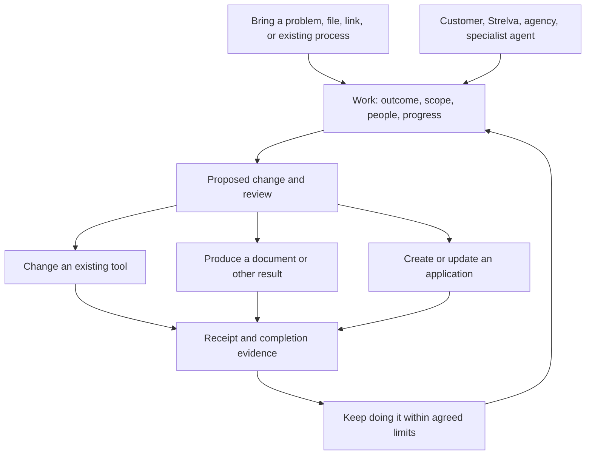

# What Strelva should let people do

Strelva is being designed as a horizontal technology product with high-growth ambition. People should be able to discover useful possibilities, create and use software, complete work, and let more of it run over time. Existing clients can become independent product users under subscriptions and usage. Agencies can build alongside other users, but agency delivery does not define the product.

This is internal concept research for Jacob. R&D stays internal. The concepts are possibilities to develop and compare, not an accepted strategy, proof of demand, or instructions to change production. Current repository limits describe what is built today; they do not set the ceiling for the product.

The earlier work-centered recommendation was too narrow and abstract. A common job history may help the implementation, but it does not explain what people adopt or why the product spreads. The relevant possibilities below differ in what users obtain: working applications, completed recurring work, interactive outputs other people can use, and products that can be adapted across teams and organizations. Several can reinforce one another.

## What the evidence supports

The evidence is sufficient to challenge the current product model and design decisive trials. It is insufficient to establish demand, willingness to pay, a winning vertical, or a completion percentage. The research combines public workflow reports, original research, current product documentation, and the repository's implementation evidence. Public complaints are individual reports. Vendor documentation establishes available mechanics, not reliable customer outcomes. Agent agreement does not strengthen a claim.

An Ipsos study for HMRC followed 20 UK SME participants through self-recorded footage and interviews during March 2022 to August 2023. Published in 2025, it is qualitative and explicitly not representative. Participants' established systems provided reassurance as well as practical function. One payroll example combined spreadsheets, Sage, paper, and confirmation emails; the duplication helped the owner feel the work was complete. The study also found reluctance to change established systems. Removing steps without replacing their assurance could therefore make a product less useful.[^1]

Three workflow families expose different problems:

| Work today | Evidence and existing answer | Possible unmet job |
| --- | --- | --- |
| A professional requests documents, receives partial responses, interrupts work, and returns later | One tax practitioner described this despite using organizers. Karbon already supplies checklists, uploads, reminders, and work-item updates.[^2][^3] | Determine whether the evidence is sufficient to resume, across the channels participants actually use |
| A bookkeeper tries to explain a bank deposit across sales, fees, refunds, and settlement records | A Shopify community question was answered with an existing payout export. QuickBooks documents a detailed reconciliation troubleshooting process.[^4][^5] | Resolve the exceptions that remain after good exports, native matching, and configuration |
| A team gradually turns a spreadsheet or base into an operational system | An Airtable user needed help modeling equipment maintenance; the answer involved relationships and recurrence logic. AppSheet documents recovery difficulties when schema changes meet unsynced data.[^6][^7] | Change a relied-upon system without losing its meaning, pending work, or recovery path |

These are opportunities to investigate, not three selected products. A native feature, better setup, or training may solve each problem more cheaply. The Shopify example is particularly valuable counterevidence: apparent product demand can be a discoverability problem.

An older analysis of 65,000 spreadsheets from two organizations supports the existence of spreadsheet-based coordination in larger settings. It dates to 2011 and cannot establish current prevalence or buying behavior.[^8] Large-organization demand remains especially under-researched here. Departmental workflow evidence must precede claims about enterprise adoption.

Five reframings deserve investigation before features are selected:

1. A request for a dashboard may actually be a need to know what deserves attention.
2. A request for reminders may be a need to distinguish missing evidence from an incomplete task.
3. A request for an app may be a need to maintain a business rule across several tools.
4. A request for an agency may be a need for someone to retain responsibility after delivery.
5. A request for automation may be a need to make judgment easier, with routine steps already adequately automated.

## The alternatives are stronger than our earlier notes assumed

Retool's current offering includes apps, workflows, agents, permissions, environments, releases, audit logs, and agent evaluation and observability. It is a strong single-product comparison for Strelva's proposed breadth.[^9] Airtable Omni can build interfaces and automations and work on records within the user's permissions. Its documentation also lists limitations, including forms, table sync setup, export, and base-permission configuration.[^10]

Zapier documents agent approval steps and broader cross-tool execution.[^11][^12] Make preserves failed execution information and supports recovery, with documented storage and data-loss conditions.[^13] n8n supports retries with previous execution data using the original or current workflow.[^14] Lovable documents GitHub synchronization and hosting choices; complete operational migration still needs a practical test.[^15] Gumloop's usage model makes completed steps, loops, and partially failed work economically relevant.[^16]

These products contradict an argument that inspection, governance, recovery, or code ownership are absent from the market. They do not prove that all providers achieve the same behavior, or that any of them reliably owns a customer's entire business outcome.

The generic-model comparison also needs updating. Current ChatGPT Work documentation describes authorized multi-step work, local and hosted execution, and tasks that can continue while a user is away.[^17] Scheduled tasks can use connected tools and, on eligible plans, supported app events.[^18] Browser functionality includes website interaction and signed-in work, subject to permissions and availability; blocked automation and unsupported sign-in remain limits.[^19] Long-running work already accepts outcomes, constraints, and completion criteria.[^20]

Consequently, persistent context, tool access, scheduling, and outcome-oriented conversation cannot alone justify Strelva. The relevant control is a competent person using a current general assistant and native software, not a blank chat window. Strelva must earn its place through a better complete service: useful discovery, accepted business rules, maintained integrations, shared responsibility, recoverable changes, and lower total human effort. Whether customers will pay enough for that difference is unknown.

## Four substantial product possibilities

### 1. Turn something you already have into software you can use

An operations manager brings an equipment spreadsheet. Strelva shows a working example using a safe copy: an equipment list, maintenance schedule, a technician's mobile form, and a view of overdue work. The manager can click a field or rule to change it. Strelva asks about ambiguous meaning, such as whether maintenance is due by mileage, date, or whichever arrives first. It does not make the person design a database or name the right software category.

The completed result is an application with its own records, users, rules, and links to the source where appropriate. It can run inside Strelva or be presented to its own audience. The next visit is to use that application, change a rule, or add a related ability. Someone starting from nothing can begin with an example, a website, or a description of the business rather than a spreadsheet.

The capability is larger than generating an interface. It includes understanding an existing working model, constructing the missing behavior, letting a person change it directly, and preserving the result through future changes. E-U6 and E-U7 expose the modeling and change-management difficulties; E-C01 and E-C02 establish strong existing builder alternatives. Those sources support investigating lifecycle behavior rather than claiming app generation alone is new.

The proposed growth mechanism is that useful apps recruit their actual collaborators and users. A manager invites technicians; another department sees the result and adapts it. More applications, records, active use, and authorized execution can expand a subscription without turning every addition into a project sale. This depends on recipients obtaining value with little setup. Invitations do not automatically establish a network effect.

The hard question is whether creating and maintaining the app becomes substantially easier than using Airtable, Retool, a general assistant, or a dedicated product. A useful investigation gives unfamiliar users existing business material and observes whether they reach a working result, understand its rules, and later change it without a specialist. Test maintenance as well as the first generation.

### 2. Let useful work keep happening across the tools you already use

A team connects an approved project system and document source. Strelva finds that several project handoffs lack required material, shows the actual cases, and offers to prepare them. It organizes the available evidence and asks only about unresolved requirements. After reviewing a successful result, the team can authorize the same bounded work on future handoffs.

The product is an ongoing ability the team uses, with each result inspectable. People return for decisions, adjustments, and new work, rather than to prompt every step. A website, email, spreadsheet, or project tool can remain the place where other participants interact. Strelva can create a small review view when a decision is awkward in the existing software; that view need not become a permanent application.

This could grow from one useful task to several ongoing tasks, then across a team as coworkers rely on the results. Subscription and usage can reflect actual software operation. Human help remains available where the offering includes it, but unlimited managed delivery is not the default product promise.

E-U1–E-U5 suggest reasons to preserve current tools and distinguish meaningful completion from activity. E-F1–E-F4 also make this a demanding competitive space: general assistants already have connected, scheduled, multi-step capabilities. Strelva would need materially better business setup, specific completion checks, coordination, and repeat operation. Persistent access by itself is insufficient.

The critical constraint is the amount of review left for the customer. One investigation should compare the same recurring job under Strelva, a current general assistant, and well-configured native automation. Include a missing input and a provider failure. Count customer review, corrections, and support along with successful execution. If the customer must continually supervise the process, the product has not delivered the intended autonomy.

### 3. Create something another person can actually use

A user prepares a proposal with scope, schedules, and pricing assumptions. Instead of sending a static document and receiving several rounds of clarification, they share an interactive proposal. Its recipient can inspect alternatives, adjust permitted assumptions, ask a question grounded in the proposal, and make an explicit decision. Authoritative commercial terms remain under the author's control.

Other examples include a project handoff that accepts missing files, a property comparison that remembers a buyer's priorities, and a planning model that a team can update together. These are illustrative concepts, not established demand from the workflow sources. The product must choose the smallest useful interaction; a readable document remains right when interactivity adds no value.

What persists is the output, its source material, permitted interactions, decisions, and history. On return, the author sees changes and unresolved decisions. The recipient sees the part relevant to them. With permission, a recipient can adapt the structure for their own work using their own data. That creates a possible path from receiving useful output to becoming a creator.

This is a different adoption mechanism from inviting someone into a general business workspace. Value arrives before account setup. The resulting growth loop would be creation, useful sharing, recipient participation, and independent reuse. Whether recipients want to reuse anything is unknown. Sharing can also expose sensitive material, so reusable structure must be separated from private content and access.

Lovable distinguishes a published application from its editable project and permits independent remixing under selected access settings.[^21] Notion documents template distribution, previews, and duplication measures.[^23] These mechanics make recipient-to-creator adoption plausible to examine; they do not establish that users will spread Strelva or that copied outputs remain safe and current.

A generic assistant can create documents and interactive artifacts. The product advantage would have to come from live permitted state, domain actions, collaboration, and continuity after the link is sent. Investigate recipient behavior directly: completion without explanation, fewer clarification rounds, return use, and whether adaptation produces a useful second output. A high share count without recipient value is not success.

### 4. Make a useful product that others can adapt and operate

A team creates a vendor-onboarding tool that works well. Another department chooses to use its structure, supplies its own requirements, and gets a separate installation. Strelva identifies what must change: forms, fields, roles, source connections, rules, and terminology. The receiving owner inspects the adapted example and rehearses its behavior before enabling it.

The same mechanism could work across businesses. An agency could offer a reusable application; an organization could distribute an approved internal tool to departments; an individual could adapt a useful public example. These relationships do not require an open marketplace on day one. Sharing an invitation or installation link is enough to study whether adaptation works.

The completed product includes more than a copied interface. It has versioned behavior, safe defaults, installation-specific settings, and a clear update path. On return, its creator can offer an improvement. Each adopter can inspect the effect on its own data and preserve local changes. Client data and credentials never become part of the reusable product.

Airtable already documents managed applications and components in an organization library.[^25] Reuse or installations alone are therefore not the opportunity. The harder possibility is useful adaptation across different organizations and continued improvements that respect each installation's local choices.

Growth could compound when good products create more successful installations, and those installations yield better starting structures or compatibility knowledge. Any learning across organizations needs permitted use and isolation. A catalog of copied templates does not create this advantage by itself. The stronger possibility is reuse of operating behavior that remains understandable and maintainable after adaptation.

Strelva can charge subscription and usage for creation and operation. Creators might eventually charge for their offerings under separate explicit terms. That possibility introduces economic incentive to contribute, but also quality, maintenance, discovery, and dispute questions. No revenue share or marketplace commitment is selected here.

Investigate whether two unrelated teams can adapt the same product without extensive creator involvement, and whether a later update reaches both without overwriting local intent. Failure would suggest a template library or bespoke service rather than a repeatable software-distribution mechanism.

## How the possibilities connect

An interactive output can become an application when people keep using it. An application can acquire ongoing tasks. A useful application or task can become a reusable product. Receiving or using any of these can introduce someone to creating their own. These are hypotheses about expansion, not steps every user must follow.

A quiet interface could express the breadth through recognizable things: apps, documents, people, work, and the business they belong to. Creation can start from a file, example, link, or request. Use should open the relevant result directly. The author may need an editor; an employee may need a daily work view; an external customer may need only one form. They should not all receive a builder interface.

The important product relationships are the person creating something, the people using it, the organization controlling it, and whoever funds its operation. One person can occupy several relationships. A customer-facing app needs audience-specific access and identity; it is more than a shared work item. A reusable installation needs independent data and permissions; it is more than another link to the original.

These possibilities keep self-service central without excluding assistance. An agency can help build an app, review an automation, or publish a reusable offering inside the same product. Human help should improve activation and resolve difficult work without becoming a prerequisite for every new user. Internal R&D develops and qualifies better possibilities; it does not become a customer menu.

Strelva's own interface is also not its only possible distribution surface. OpenAI documents reviewed plugins combining workflows and authenticated tools, available through a directory shared by ChatGPT and Codex.[^24] A Strelva product could be invoked there while its state and operation remain in Strelva. That is an additional route to use, not a demonstrated acquisition channel. Platform rules, access, discovery, and economics would need qualification before making it a dependency.

## Shared behavior underneath the concepts

Within the product, **work and what Strelva has agreed to keep doing** could provide continuity across tools and contributors. People should be able to inspect both the result and the commitment behind it. Conversation helps define and change them, but history should not require reading a transcript. This does not imply that an application's end user needs the same interface as its builder.

This is a product relationship diagram, not a proposed single database or execution engine. A work item can refer to authoritative external records. It must not silently copy them into competing canonical records. A recurring responsibility can produce many instances of work while retaining its own rules, budget, owner, and history.

The original quiet sidebar still fits. New supports an open request and a small number of relevant examples. Search finds work and objects. Businesses provide context; recent work provides continuity. A user can obtain value before creating an organization. Necessary ownership, payment, and permissions become explicit before persistence, sharing, or consequential action requires them.

Business home remains Needs you, Strelva is handling, What changed, and What's live. The proposed refinement is that What's live includes both Strelva applications and connected operations, clearly identified. It must not present a connected provider as an application Strelva owns. A document belongs with its work; it does not need a permanent app tile.

Work keeps the request, shape, plan, relevant preview, and receipt. Its final action should name the consequence. Publishing a website can say Make live. Producing a private document may say Save. An approved provider update should identify what will change. Requiring an extra publication step for every result would add work and blur real authority.

Record views can share selection, timeline, navigation, and inspector patterns. They should retain domain-specific meaning: a booking needs time and availability; a reconciliation needs differences and supporting entries. Consistency does not require identical screens. Temporary review views should disappear when the work is resolved, while their evidence remains retrievable.

Agency access stays a scoped way to participate. The handoff identifies what is accepted, what remains uncertain, what authority transfers, and who now owns recovery. Credentials and unrelated client data do not travel with a reusable pattern. External participants receive only the relevant work, rather than a tour of Strelva's entire workspace.

## Capabilities worth exploring

These are candidate behaviors, grouped by the outcome they make possible. They are not promises that the branch already implements them, nor a commitment to ship every row.

| Capability | Concrete behavior | Visible feature | What must be true underneath |
| --- | --- | --- | --- |
| Find useful work | Given permitted context, notice an unresolved handoff and show the evidence | A relevant suggestion with Ignore and Try | Source scope, freshness, deduplication, and an explicit unknown; no inference treated as permission |
| Learn a process from an example | Someone demonstrates preparing a client packet; Strelva proposes the steps and asks about ambiguous judgment | Show me how you do it | Capture consent, sensitive-field handling, editable interpretation, and checks on unseen cases |
| Know whether inputs are complete | Collect documents through allowed channels and distinguish received from sufficient | Shared request and a clear Ready state | Case identity, evidence requirements, substitution rules, conflicting documents, expiry, and review |
| Investigate a discrepancy | Explain why a payout, order, or status differs between sources | Difference, evidence, proposed resolution | Deterministic checks where possible, source references, uncertainty, and no silent record merging |
| Build only what is missing | Add a form, approval view, tracker, or application when existing tools do not cover the job | Editable preview using Strelva components | Explicit ownership, supported actions, permissions, migrations, and a maintenance path |
| Maintain a working system | Detect a changed field or rule and propose a safe repair | A change with affected work and before/after | Dependency knowledge, versioned contracts, pending-write handling, and bounded rollback or compensation |
| Keep a responsibility | Handle routine cases and escalate the exceptions that require judgment | Plain-language standing job with Pause | Durable state, triggers, deduplication, budgets, review rules, monitoring, and recovery ownership |
| Bring in help | An agency or specialist takes a bounded part and returns usable evidence | Invite to this work and handoff status | Scoped authority, acceptance, cost ownership, revocation, and preserved history |
| Prove whether it helped | Compare observed effort, errors, delays, and costs with a baseline | An answer when asked what improved | Measurement definitions, actual versus estimated values, support costs, and causal uncertainty |

The frontier enables reconsidering the workflow, but it does not establish these full behaviors. Current browser and connected-tool capabilities make demonstrated or cross-site procedures plausible to trial. They do not prove that Strelva can infer a complete procedure from one recording. A generated interface can make a decision easier without becoming a lasting application. A model may investigate a discrepancy while deterministic code controls matching and writes. Faster or cheaper inference may expand recurring work, but only measured cost per accepted result can justify it.

Three additional possibilities merit bounded research rather than immediate implementation:

- **Work without opening Strelva.** A permitted event starts a responsibility, a participant answers in the tool they use, and only an unresolved decision opens a review surface. Test whether reduced interface use preserves understanding and control.
- **Repair before customers report a failure.** A provider change fails a saved rehearsal; Strelva prepares a compatible repair and shows affected work. This requires good detection and versioned provider behavior, not a generic promise that software fixes itself.
- **Retire software that is no longer needed.** Strelva identifies an application whose job is now covered elsewhere and proposes preserving its data and moving its remaining responsibilities. This challenges a business model dependent on accumulating subscriptions and screens, but aligns with saving customer time and money.

## Where the deep modules belong

These are candidate boundaries to evaluate against existing modules after behavior is selected. They are not instructions to add parallel infrastructure to REB.

| Boundary | Small interface | Complexity it should contain |
| --- | --- | --- |
| Business context | Ask what is known about this object, with evidence and permitted scope | Identity, source authority, freshness, conflicting claims, field access, and provenance |
| Work and responsibility | Start, inspect, pause, resume, hand off, and accept scoped work | Long waits, retries, concurrent contributors, cancellation, escalation, and completion evidence |
| Governed change | Propose, inspect, authorize, apply, and recover | Exact approved version, stale state, provider acceptance, duplicate prevention, and irreversible effects |
| Capability execution | Execute a supported operation against a declared contract | Provider-specific semantics, credentials, limitations, receipts, and failure interpretation |
| Presentation | Show and edit an object through supported components | Selection, accessible interaction, local edits, state transitions, and the shared change receipt |
| Outcome and cost | Record what happened and compare it with a stated baseline | Human effort, retries, provider charges, maintenance, attribution, and missing measurements |

An adapter must be able to say an external write was accepted but verification failed. That state is different from a safe retry. An Undo must distinguish restoring owned configuration from compensating for an external effect. It cannot unsend a message or erase intervening customer activity. These requirements deepen the existing governance and persistence boundaries; a new generic action service must not bypass them.

For a large organization, the same product relationships need scoped teams, organizational policy, retention, identity controls, and auditable delegation. Sensitive execution may need to stay near the data. This research has not qualified a local-worker deployment, enterprise procurement readiness, or any compliance claim. Those are separate acceptance and commercial questions, not navigation items that confer readiness.

## Internal R&D and the evidence loop

Internal R&D should decide which work is worth supporting and whether new technology changes that answer. Its durable output is a linked record of evidence, uncertainty, competing responses, trials, decisions, and subsequent results. It should preserve discarded ideas and the reason they failed so the next model does not rediscover them as fresh strategy.

The ten requested activities fit this loop: maintain outside evidence; identify repeated behavior and unresolved jobs; inspect real user evidence; assess new capabilities; generate alternatives; attack strategic assumptions; check product fit; exercise experiences; build and independently verify selected behavior; compare launch reality with expectations. Synthetic participants may attack a hypothesis, but their preferences cannot be counted as customer evidence.

Research sources should be selected for the question. Public posts can reveal vocabulary and workarounds. Procurement documents can expose organizational requirements. Provider releases establish documented mechanics. Private support conversations and customer telemetry require permitted access and purpose. Missing access to a community is a coverage gap, not permission to fabricate its view. Cross-posts and syndicated articles do not become independent demand signals.

Continuous research is a proposed operating capability. This report does not configure a scheduler or claim any recurring monitoring is running. A real implementation needs a budget, cadence, source coverage, freshness checks, outage reporting, deduplication, and a record of decisions changed by new evidence. Research volume is a poor success measure. A useful result is abandoning a weak proposal, finding a cheaper native solution, or qualifying a capability with measured customer benefit.

## Economics and failure conditions

The main risk is that acceptable completion is so specific to each business that Strelva becomes expensive custom delivery behind a common work screen. That may still be a useful business, but it would not establish the desired product economics. Another risk is that a capable assistant paired with native software becomes good enough before Strelva's accumulated operating knowledge provides an advantage.

The selected subscription-plus-usage direction should therefore be tested against the cost of ownership. For each responsibility, record setup, human review, corrections, provider costs, Strelva-caused retries, maintenance, support, and handoff. Measure customer time released separately from cash saved and revenue changed. One avoided hour is not automatically a dollar of savings, and a completed task is not evidence of revenue lift.

Recurring operation offers a reason to retain Strelva, but also creates a liability if responsibilities accumulate faster than they can be maintained. A customer should be able to pause, transfer, or retire work. The recovery promise must name its scope and budget. Strelva should not silently sell unlimited human intervention under a software usage price.

The concepts have different economic risks. Generated apps can create substantial maintenance obligations. Ongoing execution can hide large review costs. Shared outputs may attract recipients who never become paying creators. Reusable products may require so much adaptation that every installation becomes consulting. Each risk needs its own evidence; one blended score would obscure it.

## One investigation of ongoing work

Test one recurring document handoff in three different business contexts, using real permitted work and the customer's well-configured native process as the comparison. This is a proposed trial, not authorized outreach or live messaging. It isolates the common behavior while retaining domain-specific completion rules. If three contexts all require unrelated engines, the horizontal abstraction has failed an important test.

The actor is the person responsible for receiving a complete packet. Their goal is to begin downstream work without repeatedly discovering missing information. The starting state contains an agreed checklist, source locations, participants, deadlines, and review rules. The person authorizes a bounded request. Strelva tracks arrivals, identifies missing or conflicting evidence, and marks the packet ready only when the accepted criteria hold.

Acceptance scenarios:

- Given a partial packet, when a document arrives twice, then it attaches to the correct case once and the case remains incomplete if another required item is absent.
- Given conflicting evidence, when the model cannot resolve the conflict, then the responsible person sees the evidence and the case is not silently marked ready.
- Given an approved outbound request, when the provider accepts it and read-back fails, then Strelva records uncertain verification without automatically sending it again.
- Given revoked access, when work resumes, then protected reads and writes stop and recovery identifies what permission is missing.
- Given a handoff to an agency, when it accepts the work, then the customer can still inspect the same history and the agency receives only the required access.
- Given an ongoing responsibility, when the next cycle starts, then its rules and budget remain effective without copying the previous participant's private material into a new case.

Record time to verified readiness, owner review minutes, work restarts, false-ready cases, corrections, support effort, and total operating cost. Agree thresholds before the trial from the real baseline; this report does not invent them. First test against historical packets, then supervise a bounded live cycle after explicit authority. A human independently determines whether the packet was actually ready.

For any concept selected for implementation, write behavior contracts for its actual user journeys. Use TDD for mechanically verifiable state and authority, BDD for shared workflows, invariant tests for duplicate effects and data integrity, and independent adversarial review for failures. Keep the suite proportional. Jacob's end-to-end review remains a distinct gate.

Reject or change the direction if customers reperform the checking, native setup achieves the same result, maintenance absorbs the economic benefit, or the handoff creates another inbox. Results should update this concept alongside the separate app-creation, recipient-use, and product-adaptation investigations. No single trial selects the entire horizontal direction or establishes product completion.

## Questions worth developing next

The next discussion should make each product more imaginable rather than demand a winner. For app creation, show what a person gets from a real spreadsheet or website and which changes they can make themselves. For ongoing work, show an actual completed result and what happens when information is missing. For shared outputs, show the recipient experience before sign-in. For reusable products, show what changes in a second installation and how updates behave.

The growth questions follow those experiences: whether useful sharing introduces new creators, whether team use expands naturally, whether recurring operation earns continued usage, and whether adaptation becomes easier with each accepted installation. None is yet established. High-growth ambition changes the search space; it does not substitute for those observations.

Keep customer readiness, internal R&D maturity, and evidence from operated offerings separate in the [definition of done](../strelvav2-definition-of-done.md). The [horizontal acceptance ledger](../strelvav2-horizontal-acceptance.md) remains the implementation reference. A concept selected for a release must become an explicit acceptance amendment before it adds to the denominator. No concept was selected during this research discussion.

## Sources

Sources were retrieved September 11, 2026. Dates below describe the source or its observation period, not Strelva validation. No customer interviews, authenticated competitor trials, or provider-execution trials were conducted for this report.

[^1]: Angus Smith and Heidi Hasbrouck, Ipsos for HMRC, [SME longitudinal ethnography](https://www.gov.uk/government/publications/sme-longitudinal-ethnography/sme-longitudinal-ethnography-research). Report August 2024; publication June 5, 2025; fieldwork March 2022–August 2023. Qualitative, 20 participants. Evidence E-U1.
[^2]: r/taxpros, [Dealing with missing client documents](https://www.reddit.com/r/taxpros/comments/147xrl6/dealing_with_missing_client_documents_in_spite_of/), June 12, 2023. Individual public self-report, E-U2.
[^3]: Karbon, [Overview of Client Requests](https://help.karbonhq.com/en/articles/1524439-overview-of-client-requests). Vendor support documentation; relative update label, exact date unverified. E-U3.
[^4]: Shopify Community, [Detailed bank deposit report](https://community.shopify.com/t/how-can-i-find-a-detailed-bank-deposit-report-on-shopify/288629), January 24, 2024. Individual question and support answer, E-U4.
[^5]: Intuit, [Fix issues at the end of a reconciliation](https://quickbooks.intuit.com/learn-support/en-us/help-article/statement-reconciliation/fix-issues-end-reconciliation-quickbooks-online/L3mZimyAb_US_en_US). Current vendor support instructions; relative update label, exact date unverified. E-U5.
[^6]: r/Airtable, [Fleet Management and Maintenance base recommendations](https://www.reddit.com/r/Airtable/comments/1co75ph/fleet_management_and_maintenance_base_recs/), May 9, 2024. Individual self-report and community advice, E-U6.
[^7]: Google AppSheet, [Update an app](https://support.google.com/appsheet/answer/10104709?hl=en). Vendor documentation, undated. E-U7.
[^8]: Kevin McDaid et al., [Spreadsheets in Financial Departments](https://arxiv.org/abs/1111.6866), November 29, 2011. Two organizational repositories; stale for market sizing. E-U8.
[^9]: Retool, [Pricing and included capabilities](https://retool.com/pricing). Current vendor listing, undated. E-C01.
[^10]: Airtable, [Using Omni AI](https://support.airtable.com/articles/1744327578-using-omni-ai-in-airtable). Current support documentation; update displayed as one month ago. E-C02.
[^11]: Zapier, [What is Zapier?](https://help.zapier.com/hc/en-us/articles/37518970271245-What-is-Zapier). Vendor overview, updated September 8, 2026. E-C03.
[^12]: Zapier, [Add approval steps to your agent's instructions](https://help.zapier.com/hc/en-us/articles/41776074420493-Add-approval-steps-to-your-agent-s-instructions), April 29, 2026. E-C04.
[^13]: Make, [Scenario settings](https://help.make.com/scenario-settings). Current vendor documentation, undated. E-C05.
[^14]: n8n, [All executions](https://docs.n8n.io/workflows/executions/all-executions/). Current vendor documentation, undated. E-C06.
[^15]: Lovable, [Deployment, hosting, and ownership options](https://docs.lovable.dev/tips-tricks/deployment-hosting-ownership). Current vendor documentation, undated. E-C07.
[^16]: Gumloop, [Credits](https://docs.gumloop.com/core-concepts/credits). Current vendor documentation, undated. E-C08.
[^17]: OpenAI, [ChatGPT Work overview](https://learn.chatgpt.com/docs/enterprise/chatgpt-work-overview). Current official documentation, plan and policy dependent. E-F1.
[^18]: OpenAI, [Scheduled tasks](https://learn.chatgpt.com/docs/automations). Current official documentation, surface and plan dependent. E-F2.
[^19]: OpenAI, [Browser](https://learn.chatgpt.com/docs/browser). Current official documentation, rollout and permission dependent. E-F3.
[^20]: OpenAI, [Long-running work](https://learn.chatgpt.com/docs/long-running-work). Current official documentation. E-F4.
[^21]: Lovable, [Control project access](https://docs.lovable.dev/features/project-visibility). Current vendor documentation, undated. E-D01.
[^23]: Notion, [Selling templates on Marketplace](https://www.notion.com/help/selling-on-marketplace). Current vendor documentation, undated. E-D03.
[^24]: OpenAI, [Submit plugins](https://developers.openai.com/plugins/deploy/submission). Current official documentation, undated. E-D04.
[^25]: Airtable, [Using app library and components](https://support.airtable.com/articles/7878192586-using-app-library-and-components-in-airtable). Current vendor documentation, undated. E-D05.
